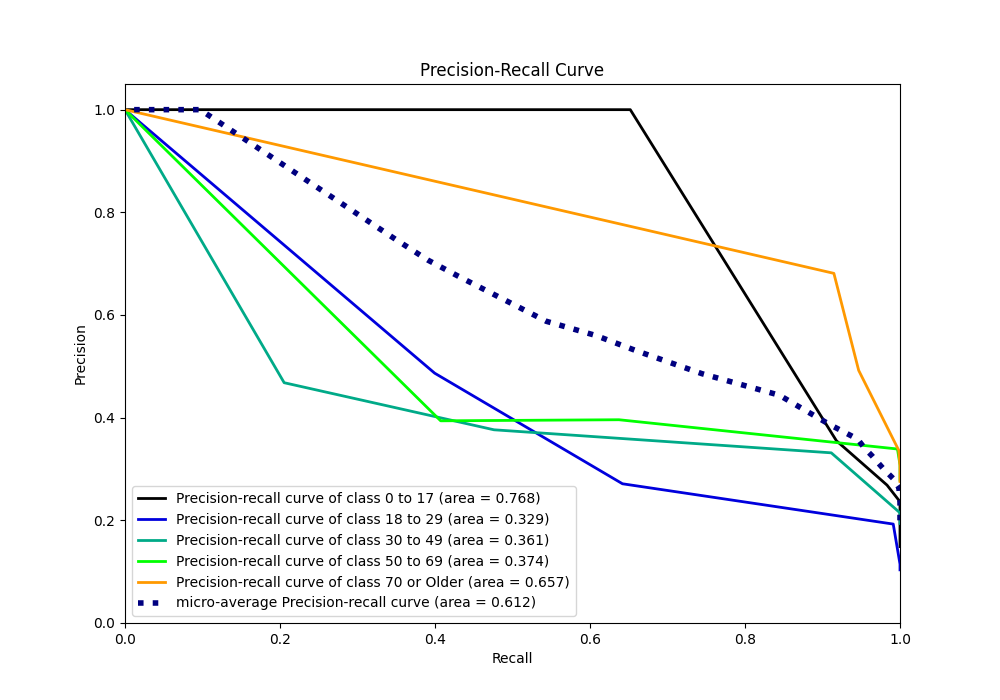

# Summary of 2_DecisionTree

[<< Go back](../README.md)

## Decision Tree
- **n_jobs**: -1
- **criterion**: gini
- **max_depth**: 3
- **num_class**: 5
- **explain_level**: 2

## Validation
 - **validation_type**: split
 - **train_ratio**: 0.75
 - **shuffle**: True
 - **stratify**: True

## Optimized metric
logloss

## Training time

11.8 seconds

### Metric details
|           |    0 to 17 |   18 to 29 |   30 to 49 |    50 to 69 |   70 or Older |   accuracy |   macro avg |   weighted avg |   logloss |
|:----------|-----------:|-----------:|-----------:|------------:|--------------:|-----------:|------------:|---------------:|----------:|
| precision |   1        |   0.486702 |          0 |    0.39596  |      0.681124 |   0.567843 |    0.512757 |       0.497112 |  0.986042 |
| recall    |   0.651976 |   0.399563 |          0 |    0.637398 |      0.914684 |   0.567843 |    0.520724 |       0.567843 |  0.986042 |
| f1-score  |   0.789328 |   0.438849 |          0 |    0.488474 |      0.780812 |   0.567843 |    0.499493 |       0.514022 |  0.986042 |
| support   | 658        | 458        |        857 | 1230        |   1219        |   0.567843 | 4422        |    4422        |  0.986042 |

## Confusion matrix
|                        |   Predicted as 0 to 17 |   Predicted as 18 to 29 |   Predicted as 30 to 49 |   Predicted as 50 to 69 |   Predicted as 70 or Older |
|:-----------------------|-----------------------:|------------------------:|------------------------:|------------------------:|---------------------------:|
| Labeled as 0 to 17     |                    429 |                      11 |                       0 |                     218 |                          0 |
| Labeled as 18 to 29    |                      0 |                     183 |                       0 |                     271 |                          4 |
| Labeled as 30 to 49    |                      0 |                     176 |                       0 |                     605 |                         76 |
| Labeled as 50 to 69    |                      0 |                       4 |                       0 |                     784 |                        442 |
| Labeled as 70 or Older |                      0 |                       2 |                       0 |                     102 |                       1115 |

## Learning curves

## Permutation-based Importance

## Confusion Matrix

## Normalized Confusion Matrix

## ROC Curve

## Precision Recall Curve

## SHAP Importance

## SHAP Dependence plots

### Dependence 0 to 17 (Fold 1)

### Dependence 18 to 29 (Fold 1)

### Dependence 30 to 49 (Fold 1)

### Dependence 50 to 69 (Fold 1)

### Dependence 70 or Older (Fold 1)

## SHAP Decision plots

### Worst decisions for selected sample 1 (Fold 1)

### Worst decisions for selected sample 2 (Fold 1)

### Worst decisions for selected sample 3 (Fold 1)

### Worst decisions for selected sample 4 (Fold 1)

### Best decisions for selected sample 1 (Fold 1)

### Best decisions for selected sample 2 (Fold 1)

### Best decisions for selected sample 3 (Fold 1)

### Best decisions for selected sample 4 (Fold 1)

[<< Go back](../README.md)
