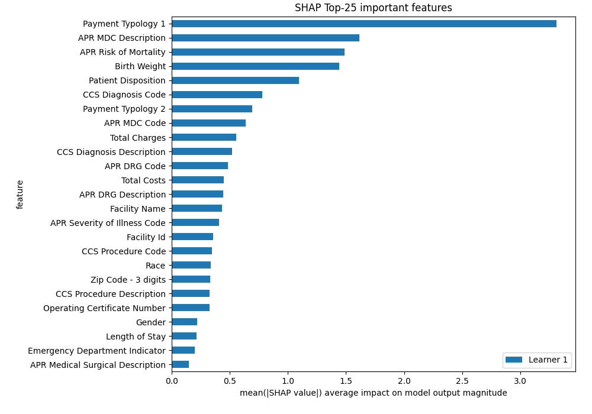

# Summary of 3_Default_Xgboost

[<< Go back](../README.md)

## Extreme Gradient Boosting (Xgboost)
- **n_jobs**: -1
- **objective**: multi:softprob
- **eta**: 0.075
- **max_depth**: 6
- **min_child_weight**: 1
- **subsample**: 1.0
- **colsample_bytree**: 1.0
- **eval_metric**: mlogloss
- **num_class**: 5
- **explain_level**: 2

## Validation
 - **validation_type**: split
 - **train_ratio**: 0.75
 - **shuffle**: True
 - **stratify**: True

## Optimized metric
logloss

## Training time

12.9 seconds

### Metric details
|           |    0 to 17 |   18 to 29 |   30 to 49 |    50 to 69 |   70 or Older |   accuracy |   macro avg |   weighted avg |   logloss |
|:----------|-----------:|-----------:|-----------:|------------:|--------------:|-----------:|------------:|---------------:|----------:|
| precision |   0.884058 |   0.553746 |   0.493218 |    0.55513  |      0.755991 |    0.65242 |    0.648429 |       0.647304 |  0.794837 |
| recall    |   0.834347 |   0.371179 |   0.466744 |    0.589431 |      0.853979 |    0.65242 |    0.623136 |       0.65242  |  0.794837 |
| f1-score  |   0.858483 |   0.444444 |   0.479616 |    0.571767 |      0.802003 |    0.65242 |    0.631263 |       0.646853 |  0.794837 |
| support   | 658        | 458        | 857        | 1230        |   1219        |    0.65242 | 4422        |    4422        |  0.794837 |

## Confusion matrix
|                        |   Predicted as 0 to 17 |   Predicted as 18 to 29 |   Predicted as 30 to 49 |   Predicted as 50 to 69 |   Predicted as 70 or Older |
|:-----------------------|-----------------------:|------------------------:|------------------------:|------------------------:|---------------------------:|
| Labeled as 0 to 17     |                    549 |                      19 |                      41 |                      49 |                          0 |
| Labeled as 18 to 29    |                     19 |                     170 |                     198 |                      70 |                          1 |
| Labeled as 30 to 49    |                     29 |                     105 |                     400 |                     296 |                         27 |
| Labeled as 50 to 69    |                     22 |                      12 |                     163 |                     725 |                        308 |
| Labeled as 70 or Older |                      2 |                       1 |                       9 |                     166 |                       1041 |

## Learning curves

## Permutation-based Importance

## Confusion Matrix

## Normalized Confusion Matrix

## ROC Curve

## Precision Recall Curve

## SHAP Importance

## SHAP Dependence plots

### Dependence 0 to 17 (Fold 1)

### Dependence 18 to 29 (Fold 1)

### Dependence 30 to 49 (Fold 1)

### Dependence 50 to 69 (Fold 1)

### Dependence 70 or Older (Fold 1)

## SHAP Decision plots

### Worst decisions for selected sample 1 (Fold 1)

### Worst decisions for selected sample 2 (Fold 1)

### Worst decisions for selected sample 3 (Fold 1)

### Worst decisions for selected sample 4 (Fold 1)

### Best decisions for selected sample 1 (Fold 1)

### Best decisions for selected sample 2 (Fold 1)

### Best decisions for selected sample 3 (Fold 1)

### Best decisions for selected sample 4 (Fold 1)

[<< Go back](../README.md)
