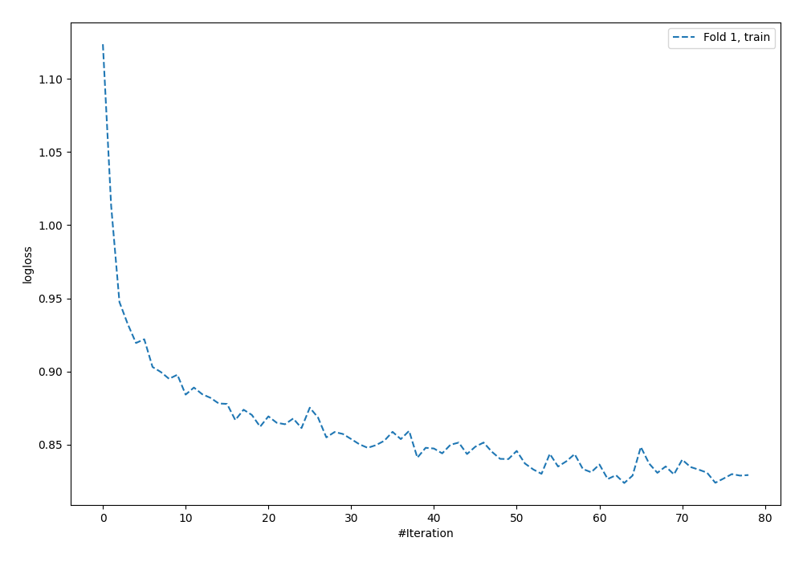
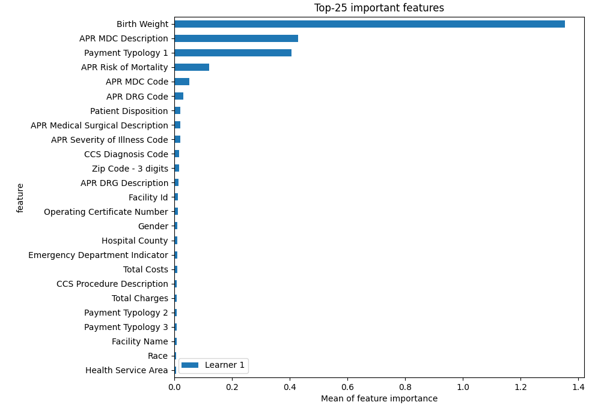
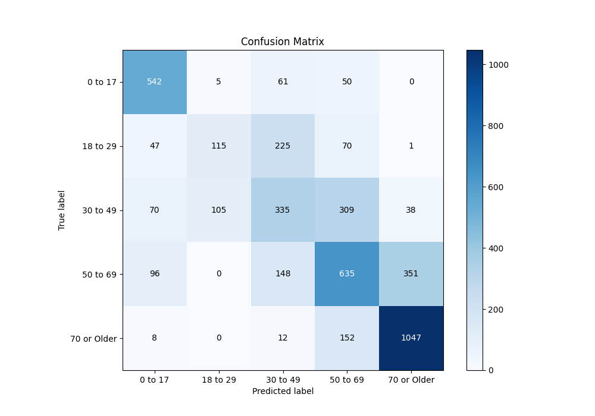
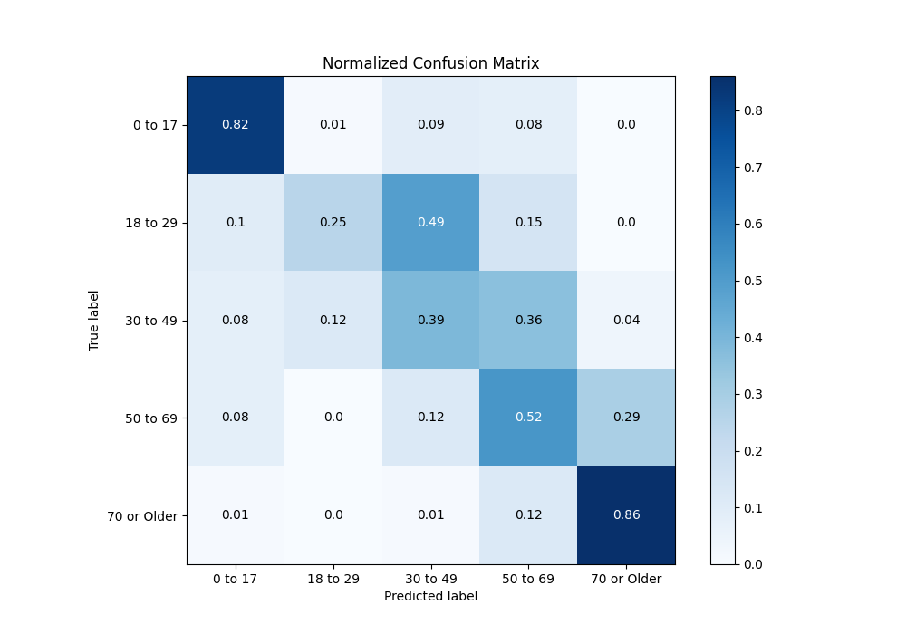
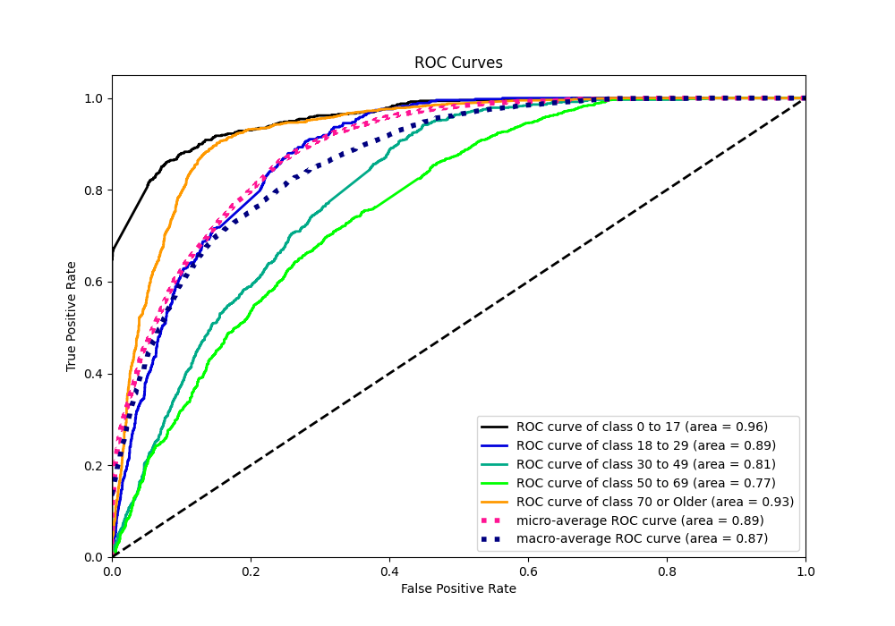
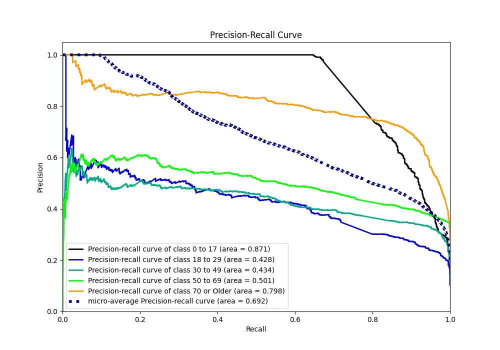

# Summary of 4_Default_NeuralNetwork

[<< Go back](../README.md)

## Neural Network
- **n_jobs**: -1
- **dense_1_size**: 32
- **dense_2_size**: 16
- **learning_rate**: 0.05
- **num_class**: 5
- **explain_level**: 2

## Validation
 - **validation_type**: split
 - **train_ratio**: 0.75
 - **shuffle**: True
 - **stratify**: True

## Optimized metric
logloss

## Training time

3.2 seconds

### Metric details
|           |    0 to 17 |   18 to 29 |   30 to 49 |    50 to 69 |   70 or Older |   accuracy |   macro avg |   weighted avg |   logloss |
|:----------|-----------:|-----------:|-----------:|------------:|--------------:|-----------:|------------:|---------------:|----------:|
| precision |   0.710354 |   0.511111 |   0.428937 |    0.522204 |      0.728601 |   0.604704 |    0.580241 |       0.587874 |  0.912978 |
| recall    |   0.823708 |   0.251092 |   0.390898 |    0.51626  |      0.858901 |   0.604704 |    0.568172 |       0.604704 |  0.912978 |
| f1-score  |   0.762843 |   0.33675  |   0.409035 |    0.519215 |      0.788404 |   0.604704 |    0.563249 |       0.589422 |  0.912978 |
| support   | 658        | 458        | 857        | 1230        |   1219        |   0.604704 | 4422        |    4422        |  0.912978 |

## Confusion matrix
|                        |   Predicted as 0 to 17 |   Predicted as 18 to 29 |   Predicted as 30 to 49 |   Predicted as 50 to 69 |   Predicted as 70 or Older |
|:-----------------------|-----------------------:|------------------------:|------------------------:|------------------------:|---------------------------:|
| Labeled as 0 to 17     |                    542 |                       5 |                      61 |                      50 |                          0 |
| Labeled as 18 to 29    |                     47 |                     115 |                     225 |                      70 |                          1 |
| Labeled as 30 to 49    |                     70 |                     105 |                     335 |                     309 |                         38 |
| Labeled as 50 to 69    |                     96 |                       0 |                     148 |                     635 |                        351 |
| Labeled as 70 or Older |                      8 |                       0 |                      12 |                     152 |                       1047 |

## Learning curves

## Permutation-based Importance

## Confusion Matrix

## Normalized Confusion Matrix

## ROC Curve

## Precision Recall Curve

[<< Go back](../README.md)
