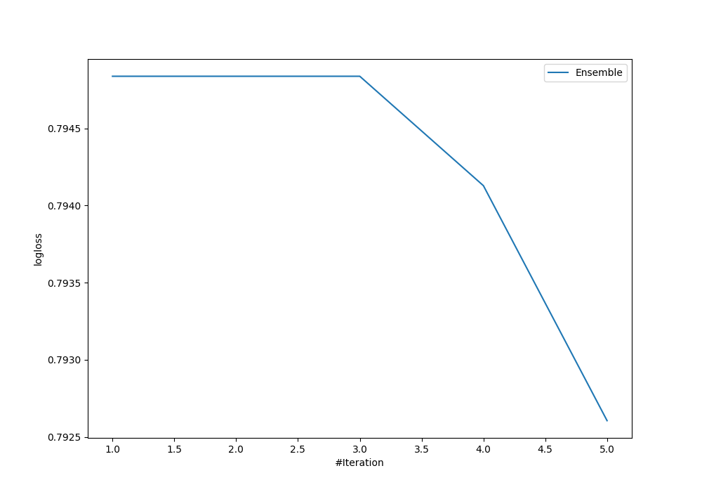
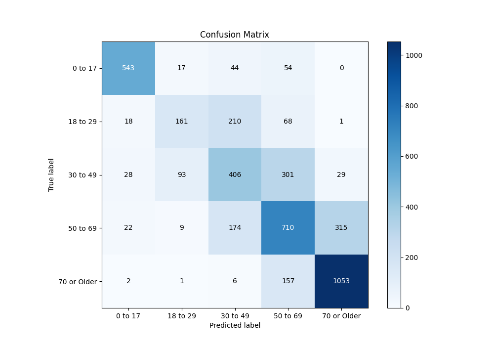
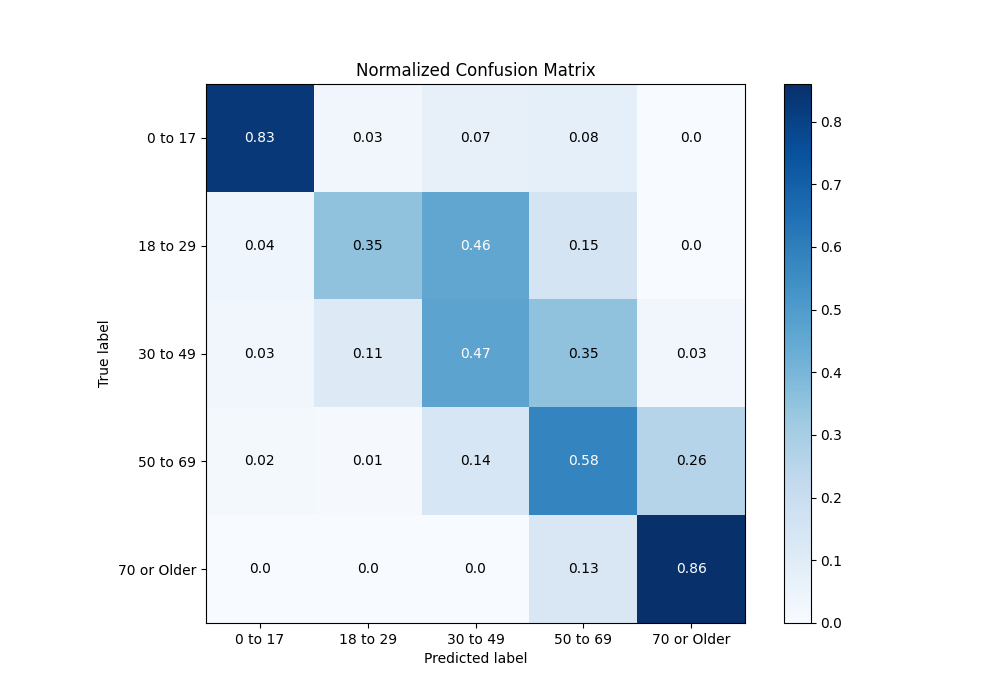
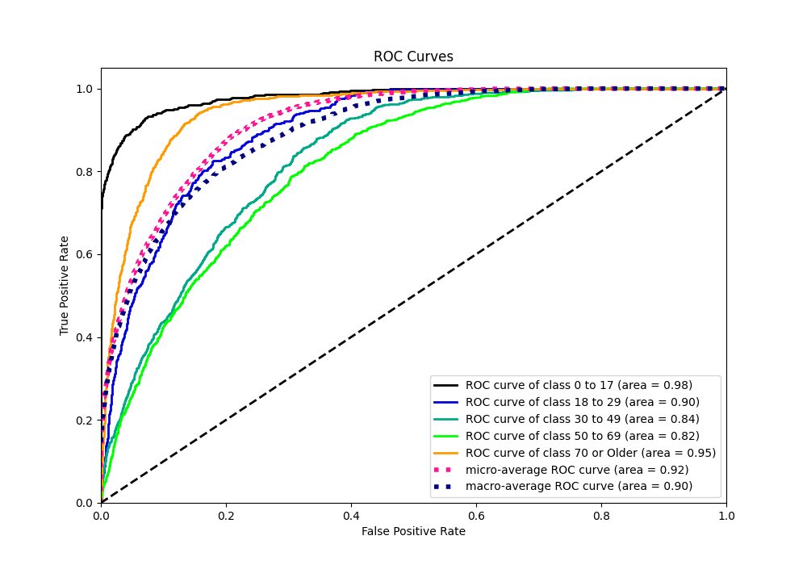
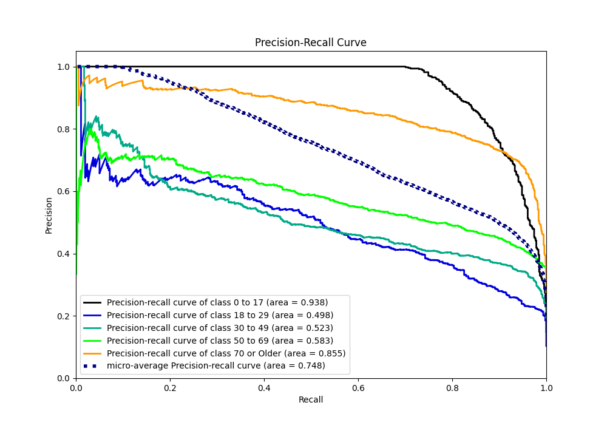

# Summary of Ensemble

[<< Go back](../README.md)

## Ensemble structure
| Model                   |   Weight |
|:------------------------|---------:|
| 3_Default_Xgboost       |        4 |
| 4_Default_NeuralNetwork |        1 |

### Metric details
|           |    0 to 17 |   18 to 29 |   30 to 49 |    50 to 69 |   70 or Older |   accuracy |   macro avg |   weighted avg |   logloss |
|:----------|-----------:|-----------:|-----------:|------------:|--------------:|-----------:|------------:|---------------:|----------:|
| precision |   0.885808 |   0.572954 |   0.483333 |    0.550388 |      0.753219 |   0.649706 |    0.64914  |       0.645554 |  0.792606 |
| recall    |   0.825228 |   0.351528 |   0.473746 |    0.577236 |      0.863823 |   0.649706 |    0.618312 |       0.649706 |  0.792606 |
| f1-score  |   0.854445 |   0.435724 |   0.478491 |    0.563492 |      0.804738 |   0.649706 |    0.627378 |       0.643583 |  0.792606 |
| support   | 658        | 458        | 857        | 1230        |   1219        |   0.649706 | 4422        |    4422        |  0.792606 |

## Confusion matrix
|                        |   Predicted as 0 to 17 |   Predicted as 18 to 29 |   Predicted as 30 to 49 |   Predicted as 50 to 69 |   Predicted as 70 or Older |
|:-----------------------|-----------------------:|------------------------:|------------------------:|------------------------:|---------------------------:|
| Labeled as 0 to 17     |                    543 |                      17 |                      44 |                      54 |                          0 |
| Labeled as 18 to 29    |                     18 |                     161 |                     210 |                      68 |                          1 |
| Labeled as 30 to 49    |                     28 |                      93 |                     406 |                     301 |                         29 |
| Labeled as 50 to 69    |                     22 |                       9 |                     174 |                     710 |                        315 |
| Labeled as 70 or Older |                      2 |                       1 |                       6 |                     157 |                       1053 |

## Learning curves

## Confusion Matrix

## Normalized Confusion Matrix

## ROC Curve

## Precision Recall Curve

[<< Go back](../README.md)
