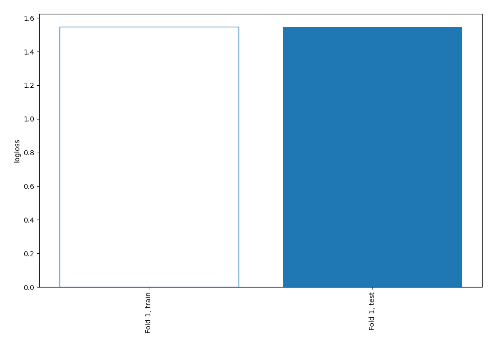
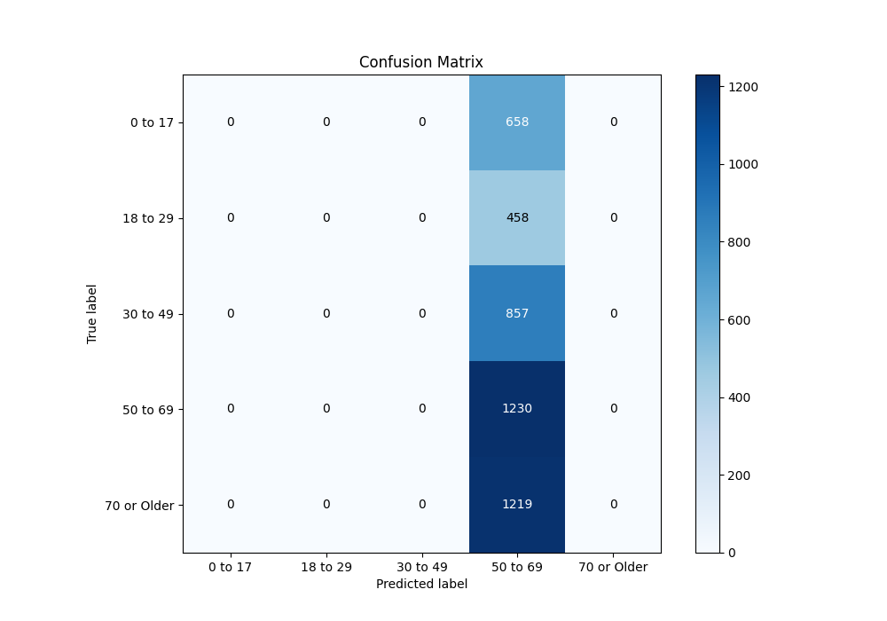
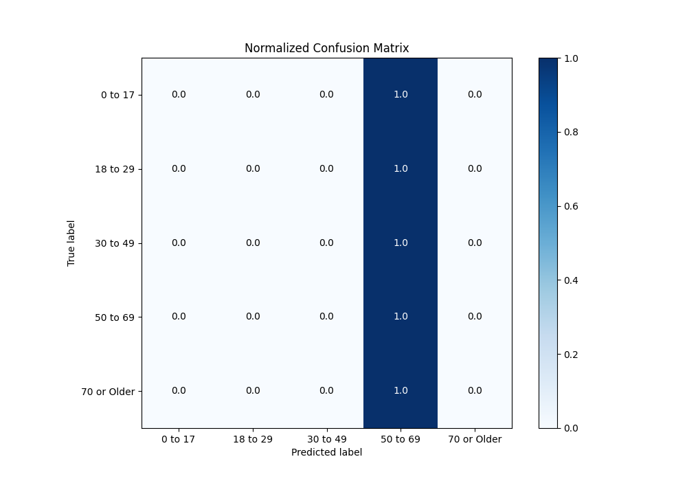
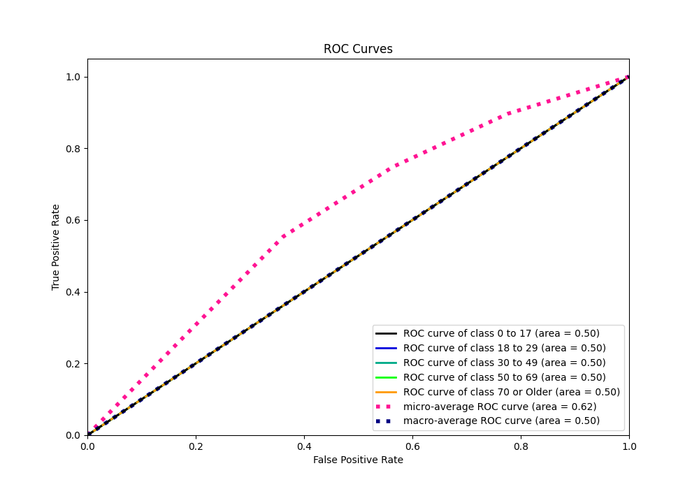
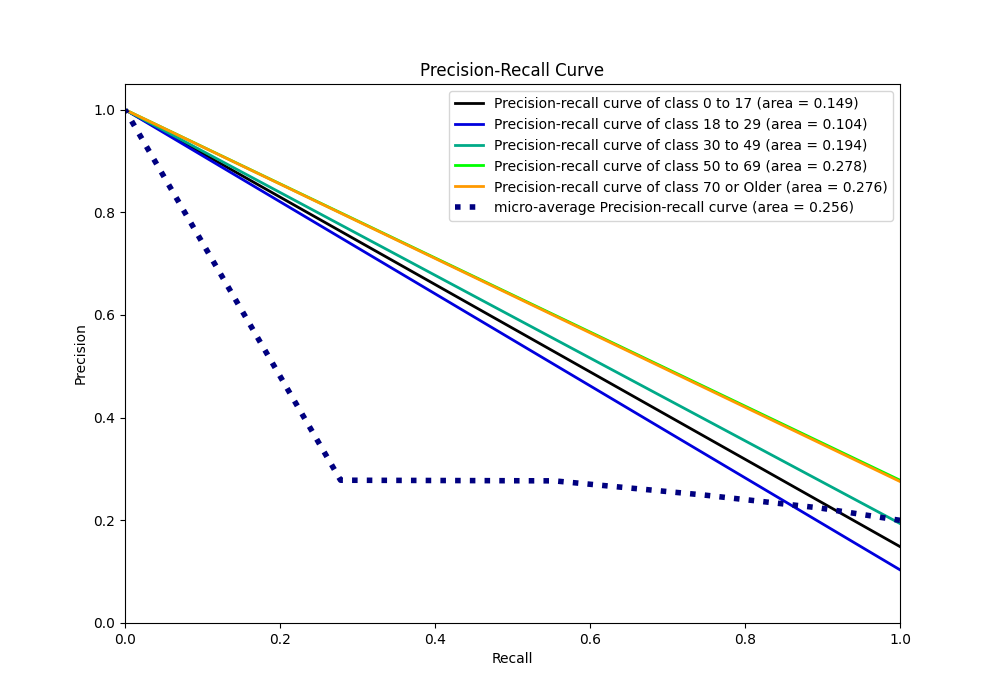

# Summary of 1_Baseline

[<< Go back](../README.md)

## Baseline Classifier (Baseline)
- **n_jobs**: -1
- **num_class**: 5
- **explain_level**: 2

## Validation
 - **validation_type**: split
 - **train_ratio**: 0.75
 - **shuffle**: True
 - **stratify**: True

## Optimized metric
logloss

## Training time

0.8 seconds

### Metric details
|           |   0 to 17 |   18 to 29 |   30 to 49 |    50 to 69 |   70 or Older |   accuracy |    macro avg |   weighted avg |   logloss |
|:----------|----------:|-----------:|-----------:|------------:|--------------:|-----------:|-------------:|---------------:|----------:|
| precision |         0 |          0 |          0 |    0.278155 |             0 |   0.278155 |    0.0556309 |       0.07737  |   1.54749 |
| recall    |         0 |          0 |          0 |    1        |             0 |   0.278155 |    0.2       |       0.278155 |   1.54749 |
| f1-score  |         0 |          0 |          0 |    0.435244 |             0 |   0.278155 |    0.0870488 |       0.121065 |   1.54749 |
| support   |       658 |        458 |        857 | 1230        |          1219 |   0.278155 | 4422         |    4422        |   1.54749 |

## Confusion matrix
|                        |   Predicted as 0 to 17 |   Predicted as 18 to 29 |   Predicted as 30 to 49 |   Predicted as 50 to 69 |   Predicted as 70 or Older |
|:-----------------------|-----------------------:|------------------------:|------------------------:|------------------------:|---------------------------:|
| Labeled as 0 to 17     |                      0 |                       0 |                       0 |                     658 |                          0 |
| Labeled as 18 to 29    |                      0 |                       0 |                       0 |                     458 |                          0 |
| Labeled as 30 to 49    |                      0 |                       0 |                       0 |                     857 |                          0 |
| Labeled as 50 to 69    |                      0 |                       0 |                       0 |                    1230 |                          0 |
| Labeled as 70 or Older |                      0 |                       0 |                       0 |                    1219 |                          0 |

## Learning curves

## Confusion Matrix

## Normalized Confusion Matrix

## ROC Curve

## Precision Recall Curve

[<< Go back](../README.md)
