# Summary of 2_DecisionTree

[<< Go back](../README.md)

## Decision Tree
- **n_jobs**: -1
- **criterion**: gini
- **max_depth**: 3
- **num_class**: 5
- **explain_level**: 2

## Validation
 - **validation_type**: split
 - **train_ratio**: 0.75
 - **shuffle**: True
 - **stratify**: True

## Optimized metric
logloss

## Training time

12.2 seconds

### Metric details
|           |    0 to 17 |   18 to 29 |   30 to 49 |    50 to 69 |   70 or Older |   accuracy |   macro avg |   weighted avg |   logloss |
|:----------|-----------:|-----------:|-----------:|------------:|--------------:|-----------:|------------:|---------------:|----------:|
| precision |   1        |   0.402957 |          0 |    0.406319 |      0.67362  |    0.56445 |    0.496579 |       0.489251 |    1.0069 |
| recall    |   0.679331 |   0.475983 |          0 |    0.595935 |      0.900738 |    0.56445 |    0.530397 |       0.56445  |    1.0069 |
| f1-score  |   0.80905  |   0.436436 |          0 |    0.483191 |      0.770797 |    0.56445 |    0.499895 |       0.512476 |    1.0069 |
| support   | 658        | 458        |        857 | 1230        |   1219        |    0.56445 | 4422        |    4422        |    1.0069 |

## Confusion matrix
|                        |   Predicted as 0 to 17 |   Predicted as 18 to 29 |   Predicted as 30 to 49 |   Predicted as 50 to 69 |   Predicted as 70 or Older |
|:-----------------------|-----------------------:|------------------------:|------------------------:|------------------------:|---------------------------:|
| Labeled as 0 to 17     |                    447 |                      33 |                       0 |                     178 |                          0 |
| Labeled as 18 to 29    |                      0 |                     218 |                       0 |                     229 |                         11 |
| Labeled as 30 to 49    |                      0 |                     229 |                       0 |                     548 |                         80 |
| Labeled as 50 to 69    |                      0 |                      56 |                       0 |                     733 |                        441 |
| Labeled as 70 or Older |                      0 |                       5 |                       0 |                     116 |                       1098 |

## Learning curves
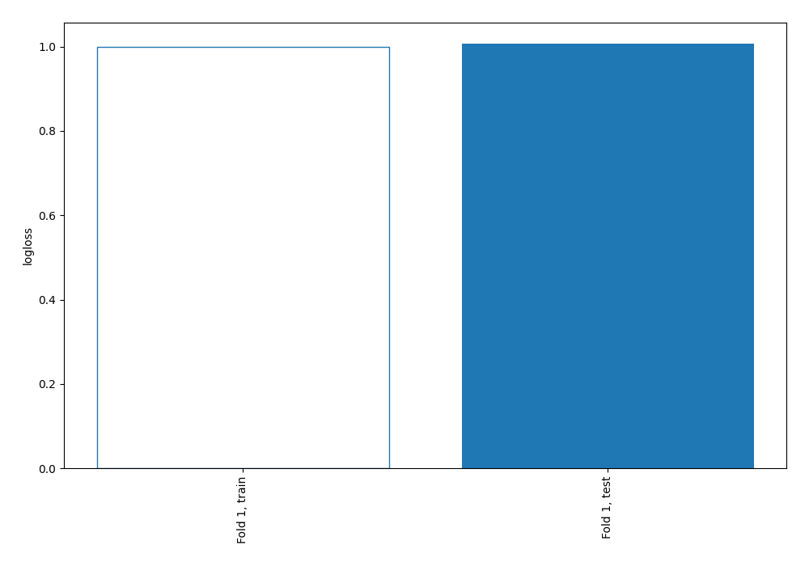

## Permutation-based Importance

## Confusion Matrix

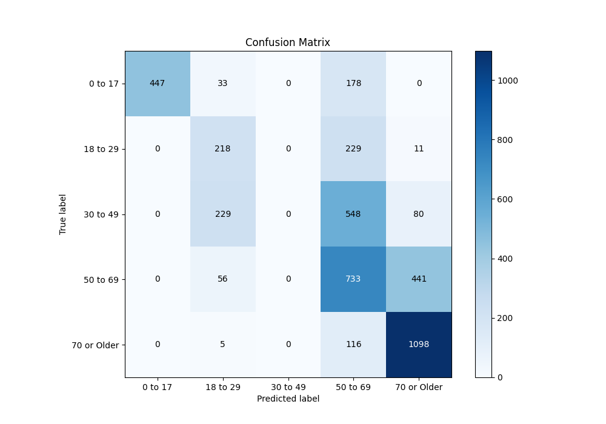

## Normalized Confusion Matrix

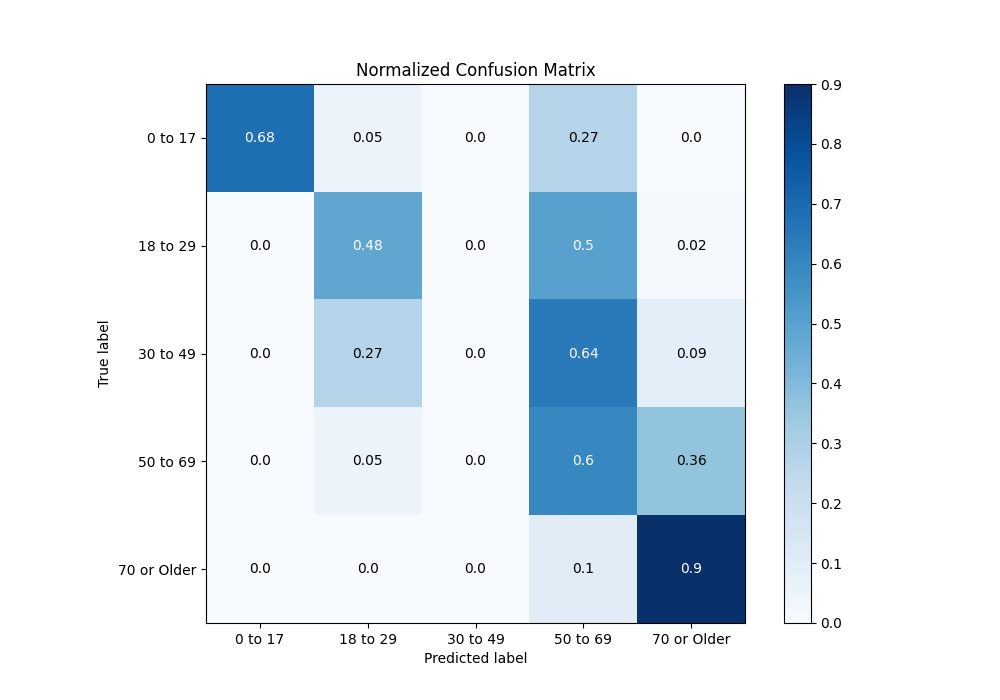

## ROC Curve

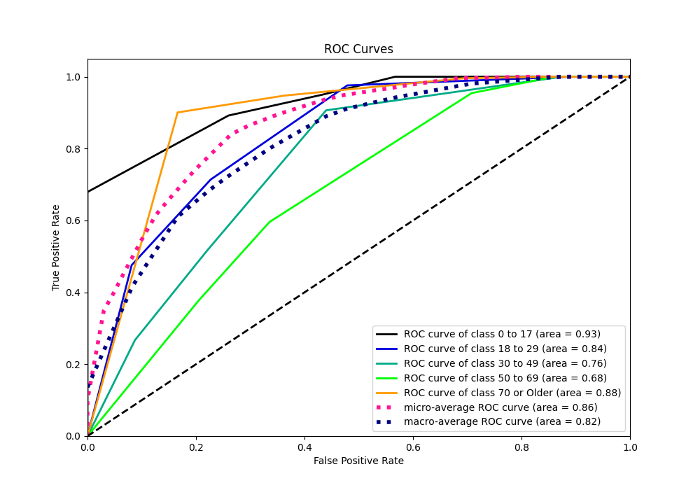

## Precision Recall Curve

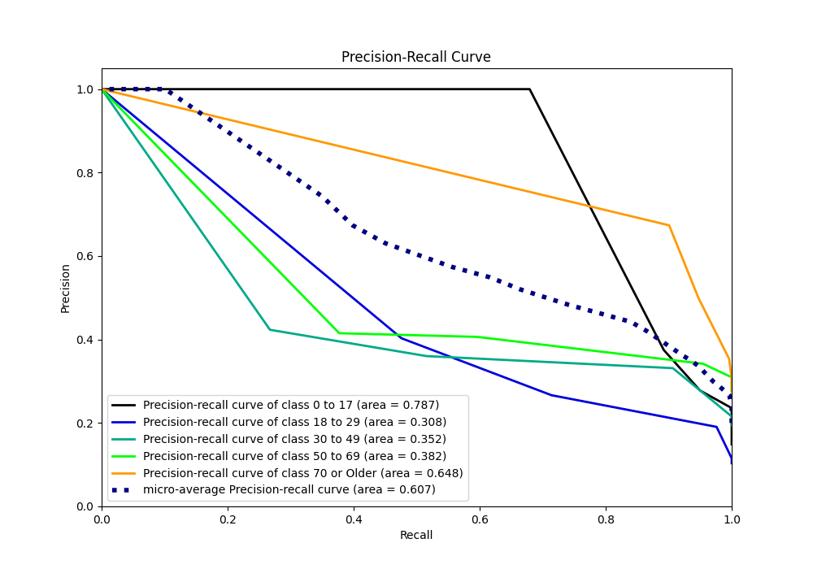

## SHAP Importance

## SHAP Dependence plots

### Dependence 0 to 17 (Fold 1)
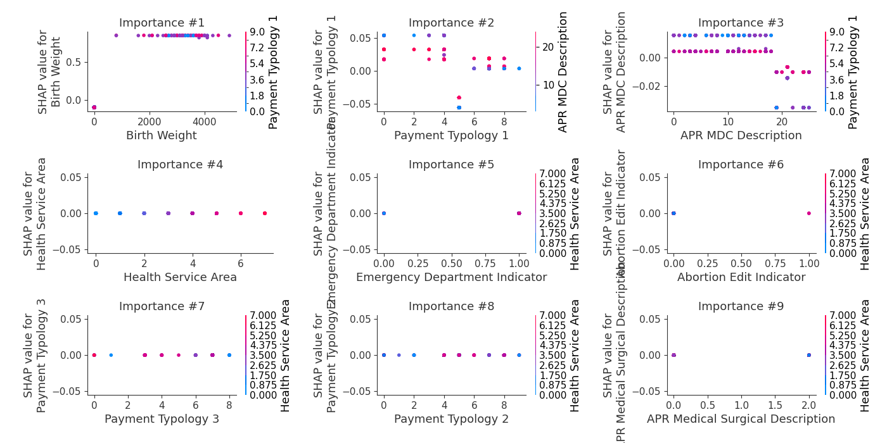
### Dependence 18 to 29 (Fold 1)
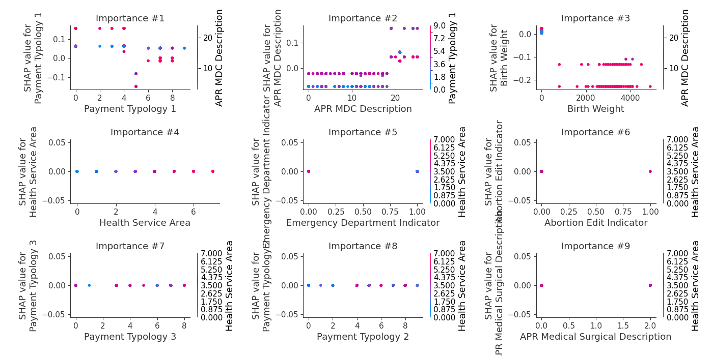
### Dependence 30 to 49 (Fold 1)
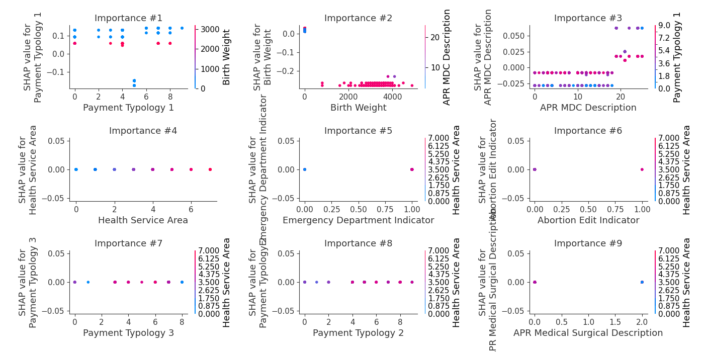
### Dependence 50 to 69 (Fold 1)
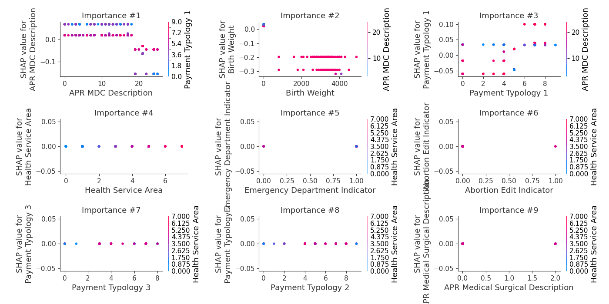
### Dependence 70 or Older (Fold 1)
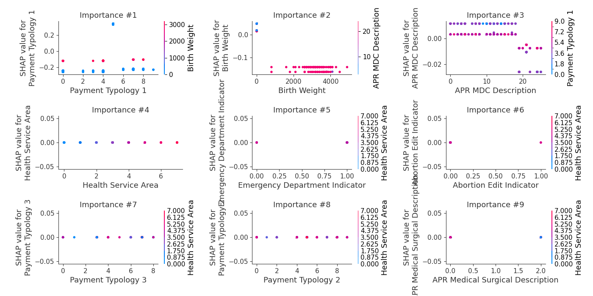

## SHAP Decision plots

### Worst decisions for selected sample 1 (Fold 1)
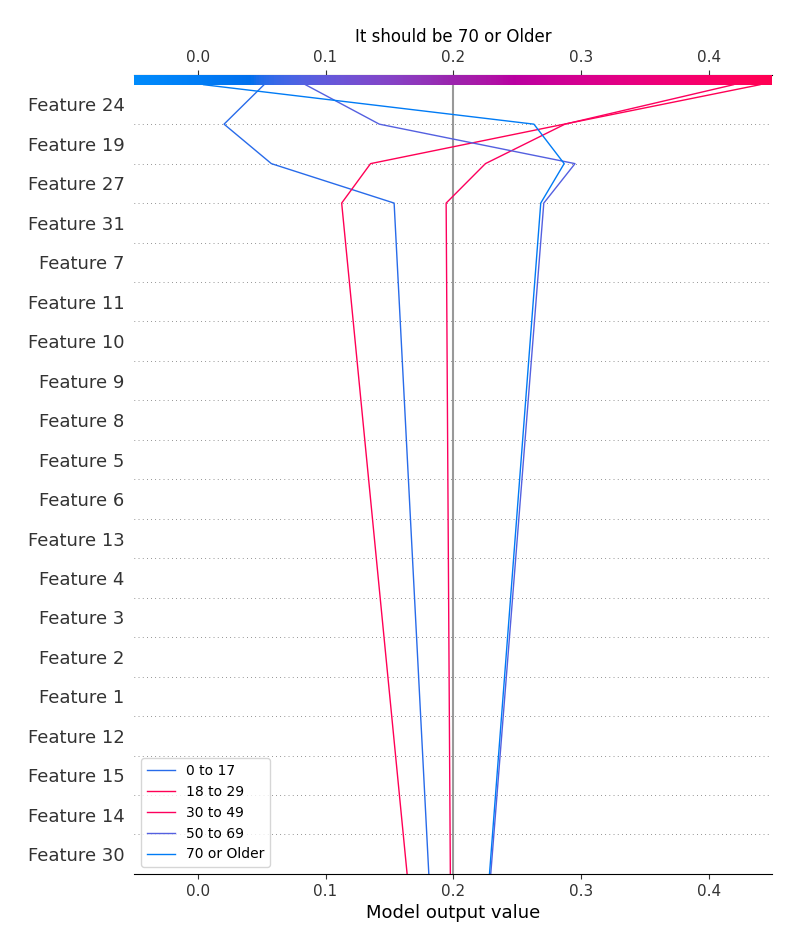
### Worst decisions for selected sample 2 (Fold 1)
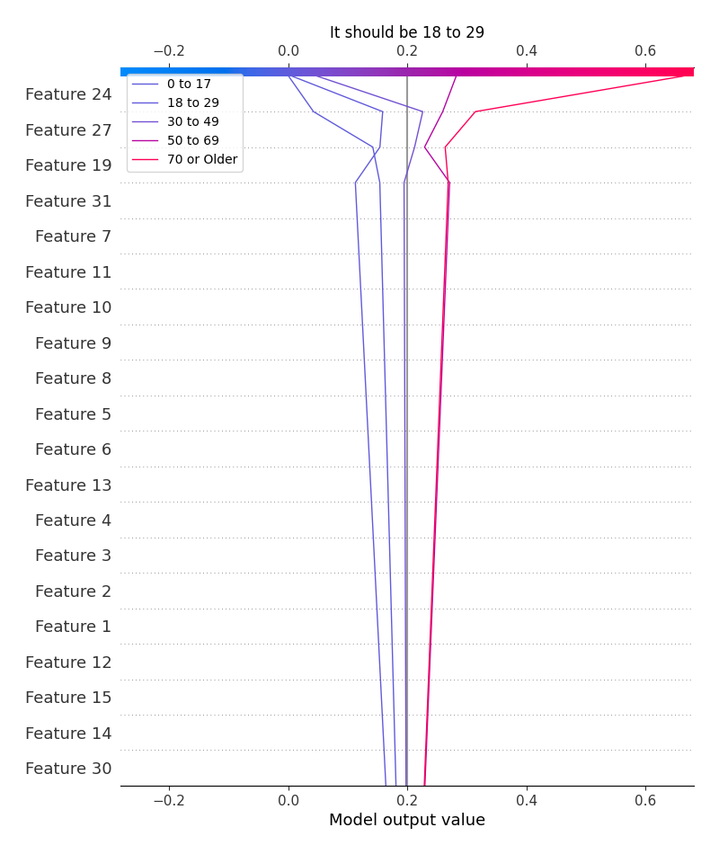
### Worst decisions for selected sample 3 (Fold 1)
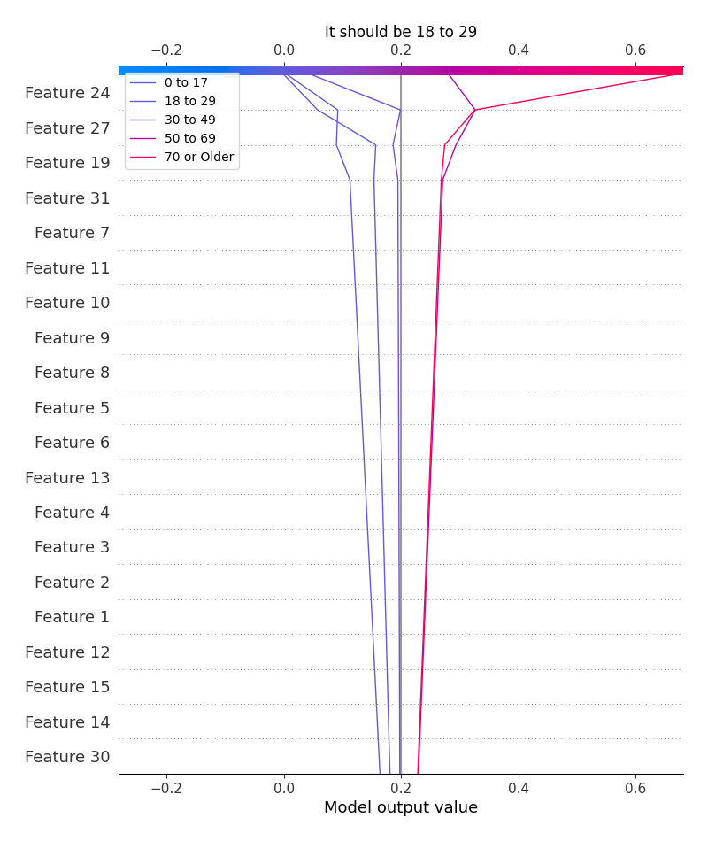
### Worst decisions for selected sample 4 (Fold 1)

### Best decisions for selected sample 1 (Fold 1)

### Best decisions for selected sample 2 (Fold 1)
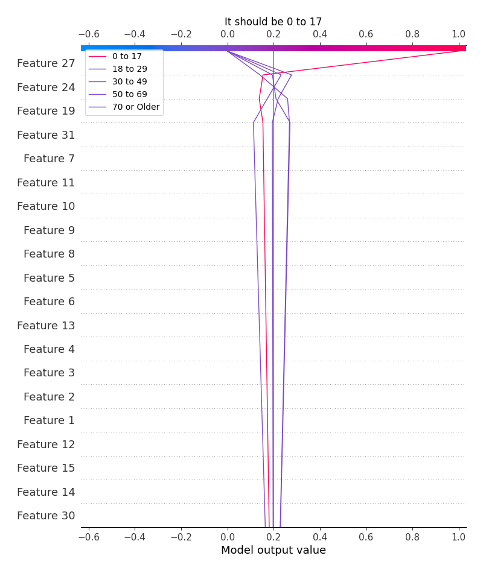
### Best decisions for selected sample 3 (Fold 1)

### Best decisions for selected sample 4 (Fold 1)

[<< Go back](../README.md)
