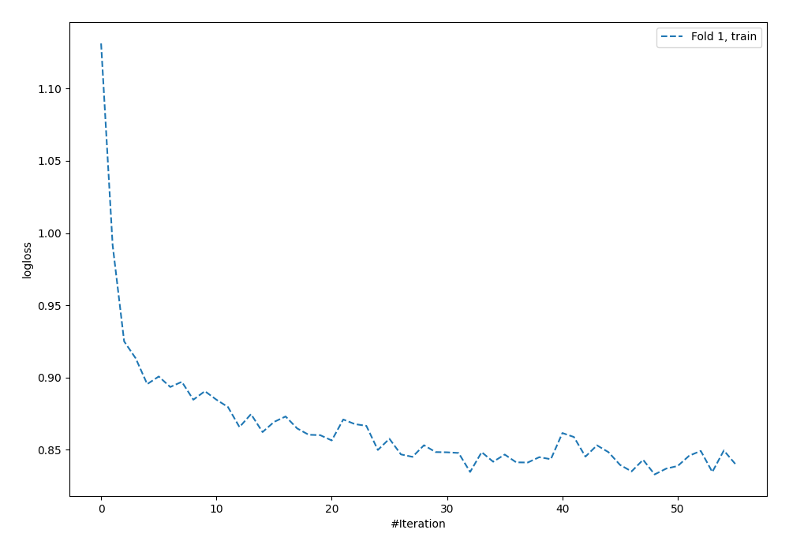
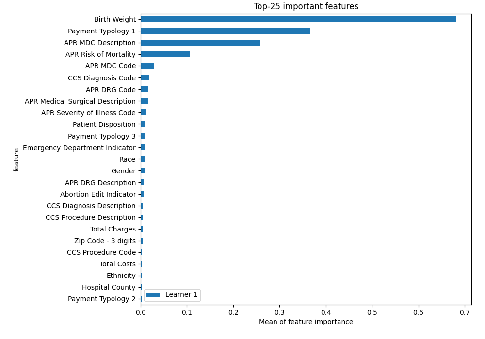
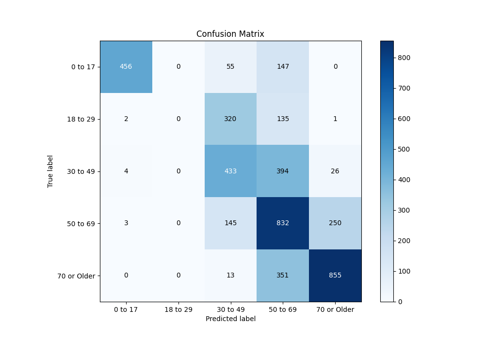
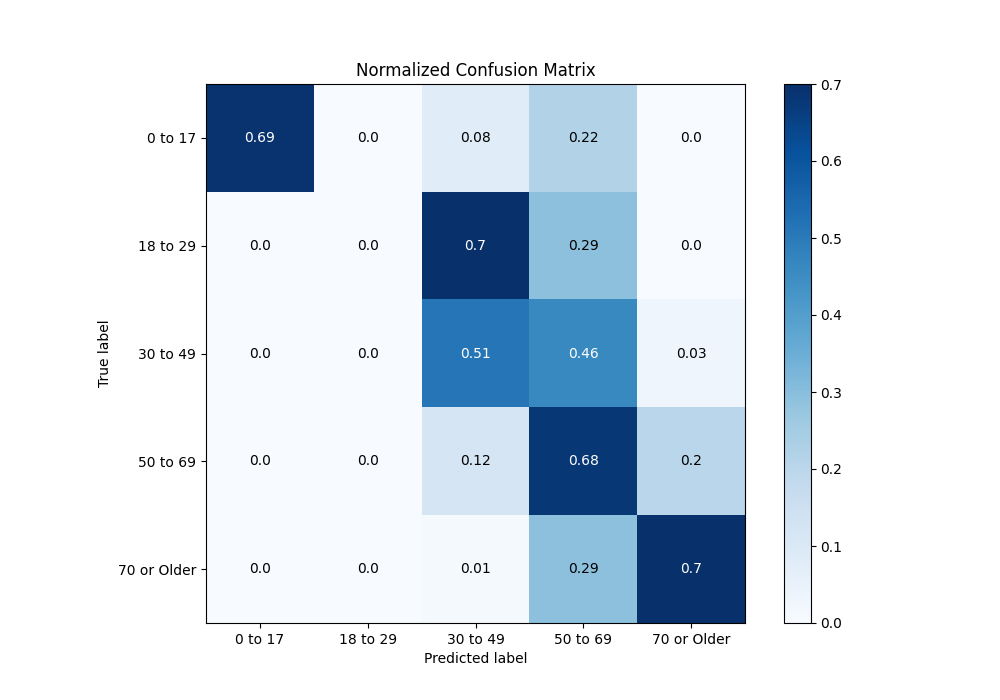
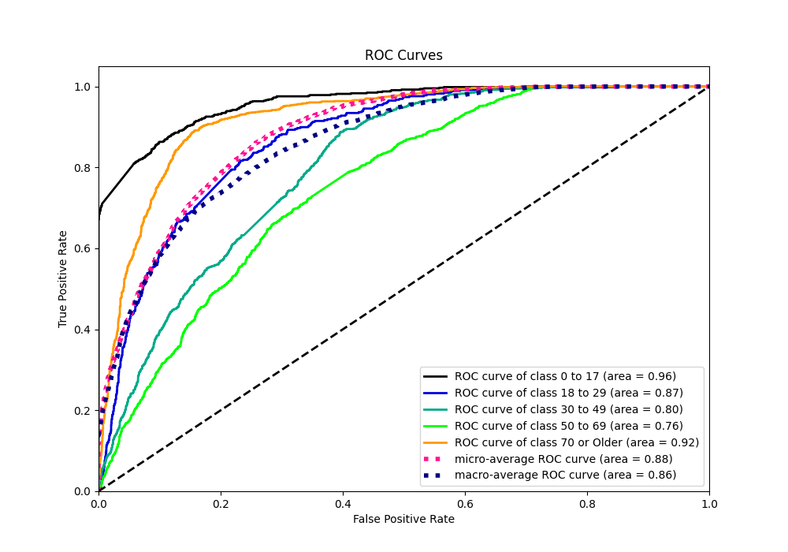
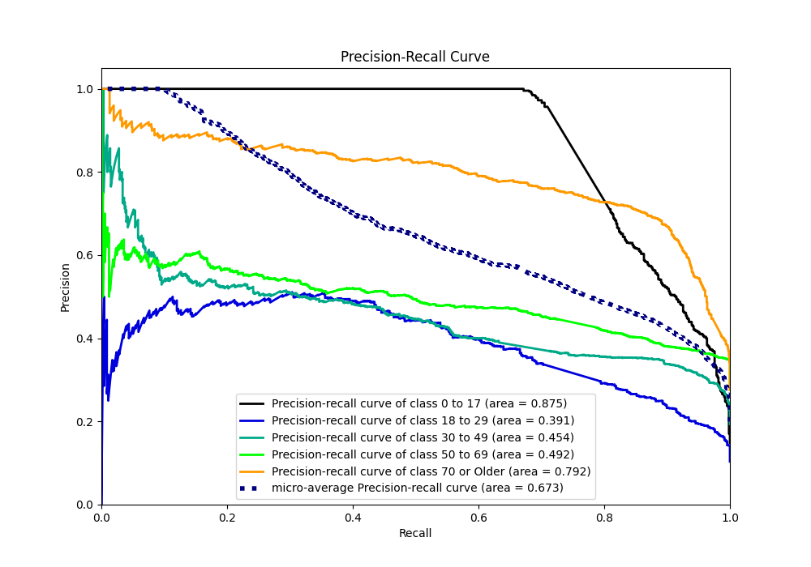

# Summary of 4_Default_NeuralNetwork

[<< Go back](../README.md)

## Neural Network
- **n_jobs**: -1
- **dense_1_size**: 32
- **dense_2_size**: 16
- **learning_rate**: 0.05
- **num_class**: 5
- **explain_level**: 2

## Validation
 - **validation_type**: split
 - **train_ratio**: 0.75
 - **shuffle**: True
 - **stratify**: True

## Optimized metric
logloss

## Training time

3.0 seconds

### Metric details
|           |    0 to 17 |   18 to 29 |   30 to 49 |    50 to 69 |   70 or Older |   accuracy |   macro avg |   weighted avg |   logloss |
|:----------|-----------:|-----------:|-----------:|------------:|--------------:|-----------:|------------:|---------------:|----------:|
| precision |   0.980645 |          0 |   0.44824  |    0.447552 |      0.7553   |   0.582542 |    0.526348 |       0.565492 |  0.937443 |
| recall    |   0.693009 |          0 |   0.505251 |    0.676423 |      0.701395 |   0.582542 |    0.515215 |       0.582542 |  0.937443 |
| f1-score  |   0.81211  |          0 |   0.475041 |    0.538686 |      0.72735  |   0.582542 |    0.510637 |       0.563252 |  0.937443 |
| support   | 658        |        458 | 857        | 1230        |   1219        |   0.582542 | 4422        |    4422        |  0.937443 |

## Confusion matrix
|                        |   Predicted as 0 to 17 |   Predicted as 18 to 29 |   Predicted as 30 to 49 |   Predicted as 50 to 69 |   Predicted as 70 or Older |
|:-----------------------|-----------------------:|------------------------:|------------------------:|------------------------:|---------------------------:|
| Labeled as 0 to 17     |                    456 |                       0 |                      55 |                     147 |                          0 |
| Labeled as 18 to 29    |                      2 |                       0 |                     320 |                     135 |                          1 |
| Labeled as 30 to 49    |                      4 |                       0 |                     433 |                     394 |                         26 |
| Labeled as 50 to 69    |                      3 |                       0 |                     145 |                     832 |                        250 |
| Labeled as 70 or Older |                      0 |                       0 |                      13 |                     351 |                        855 |

## Learning curves

## Permutation-based Importance

## Confusion Matrix

## Normalized Confusion Matrix

## ROC Curve

## Precision Recall Curve

[<< Go back](../README.md)
