# Summary of 5_Default_RandomForest

[<< Go back](../README.md)

## Random Forest
- **n_jobs**: -1
- **criterion**: gini
- **max_features**: 0.9
- **min_samples_split**: 30
- **max_depth**: 4
- **eval_metric_name**: logloss
- **num_class**: 5
- **explain_level**: 2

## Validation
 - **validation_type**: split
 - **train_ratio**: 0.75
 - **shuffle**: True
 - **stratify**: True

## Optimized metric
logloss

## Training time

10.1 seconds

### Metric details
|           |    0 to 17 |   18 to 29 |   30 to 49 |    50 to 69 |   70 or Older |   accuracy |   macro avg |   weighted avg |   logloss |
|:----------|-----------:|-----------:|-----------:|------------:|--------------:|-----------:|------------:|---------------:|----------:|
| precision |   1        |   0.509915 |   0.451613 |    0.448819 |      0.696429 |   0.597467 |    0.621355 |       0.605963 |  0.935132 |
| recall    |   0.679331 |   0.393013 |   0.212369 |    0.602439 |      0.895816 |   0.597467 |    0.556594 |       0.597467 |  0.935132 |
| f1-score  |   0.80905  |   0.443896 |   0.288889 |    0.514405 |      0.783638 |   0.597467 |    0.567976 |       0.581459 |  0.935132 |
| support   | 658        | 458        | 857        | 1230        |   1219        |   0.597467 | 4422        |    4422        |  0.935132 |

## Confusion matrix
|                        |   Predicted as 0 to 17 |   Predicted as 18 to 29 |   Predicted as 30 to 49 |   Predicted as 50 to 69 |   Predicted as 70 or Older |
|:-----------------------|-----------------------:|------------------------:|------------------------:|------------------------:|---------------------------:|
| Labeled as 0 to 17     |                    447 |                       7 |                      29 |                     175 |                          0 |
| Labeled as 18 to 29    |                      0 |                     180 |                     103 |                     166 |                          9 |
| Labeled as 30 to 49    |                      0 |                     166 |                     182 |                     450 |                         59 |
| Labeled as 50 to 69    |                      0 |                       0 |                      81 |                     741 |                        408 |
| Labeled as 70 or Older |                      0 |                       0 |                       8 |                     119 |                       1092 |

## Learning curves
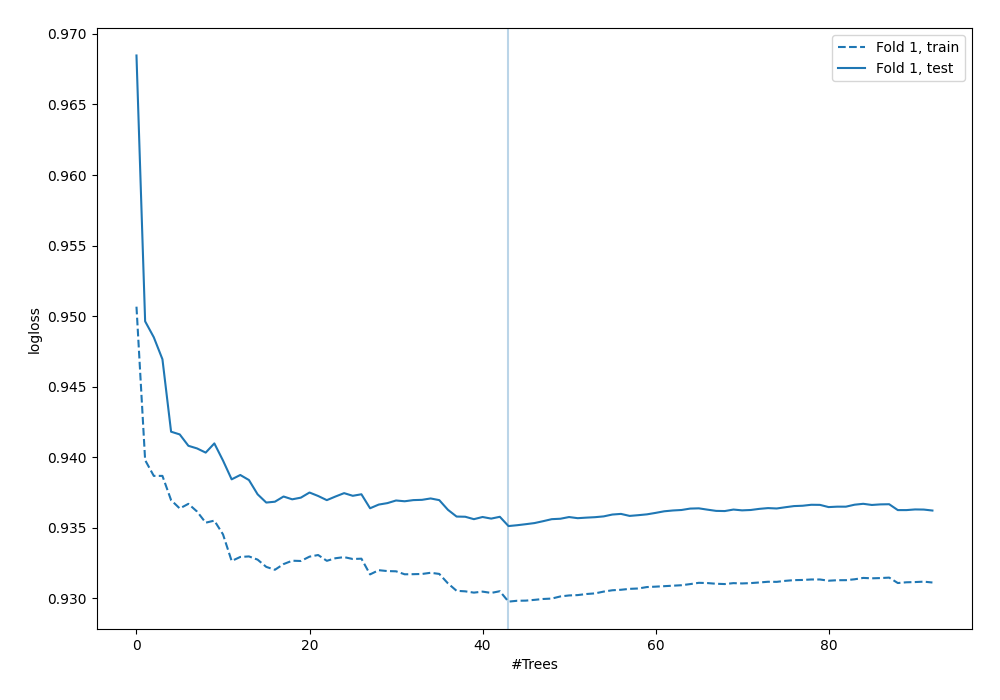

## Permutation-based Importance
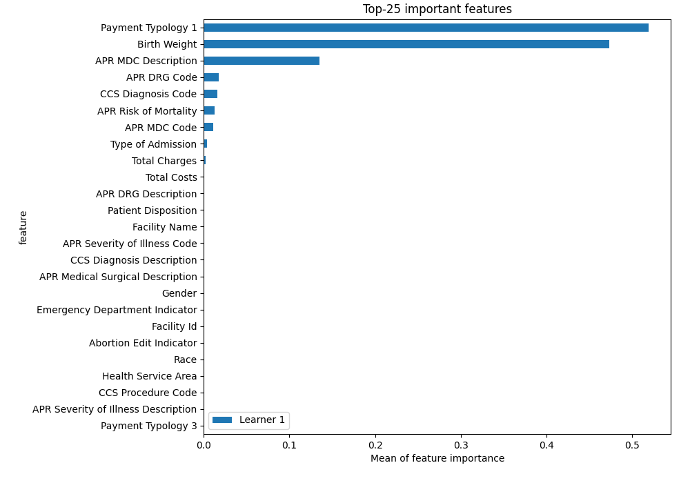
## Confusion Matrix

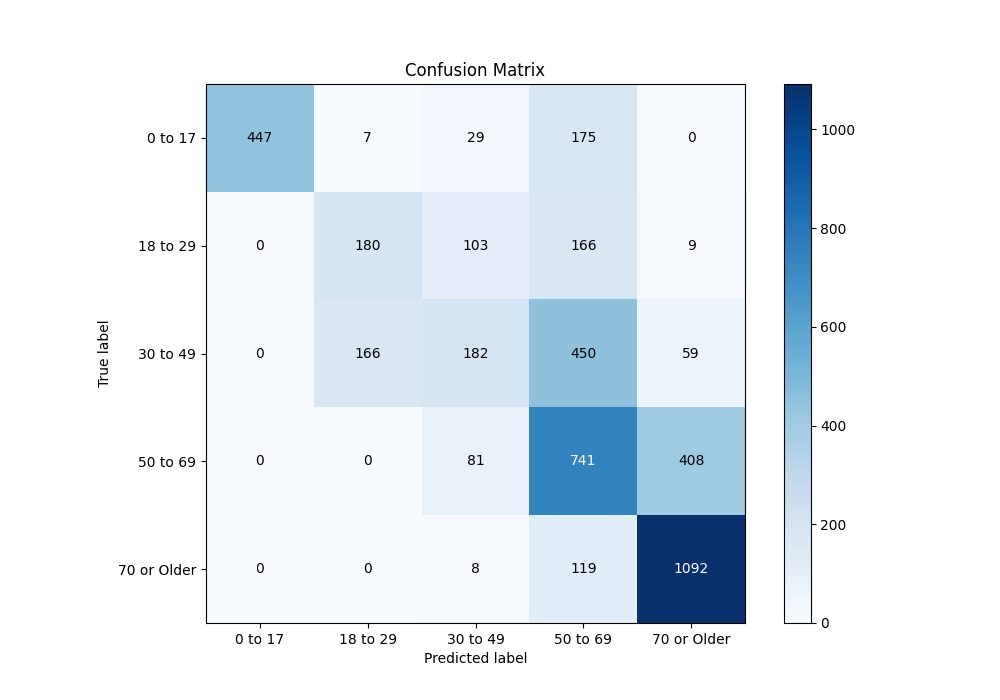

## Normalized Confusion Matrix

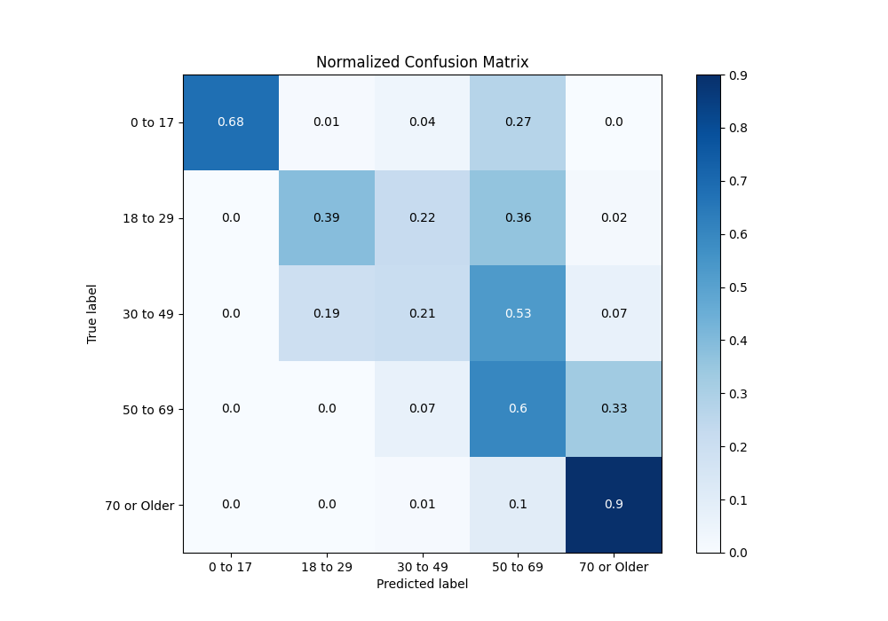

## ROC Curve

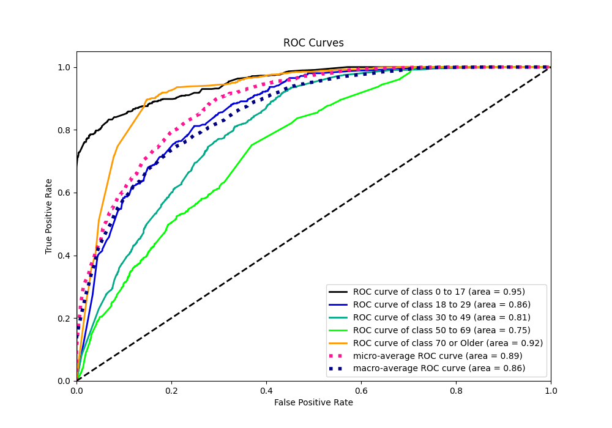

## Precision Recall Curve

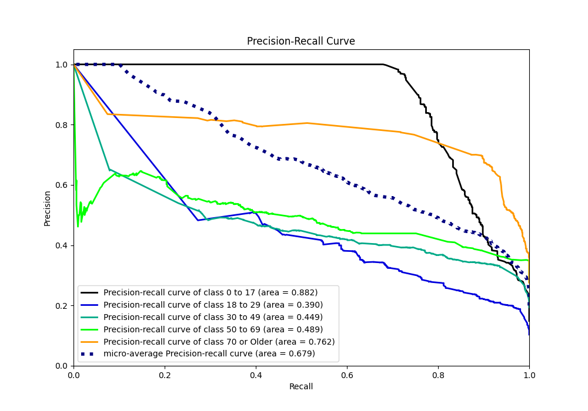

## SHAP Importance
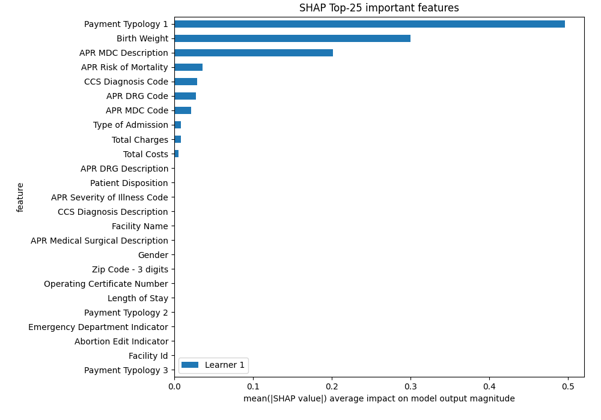

## SHAP Dependence plots

### Dependence 0 to 17 (Fold 1)
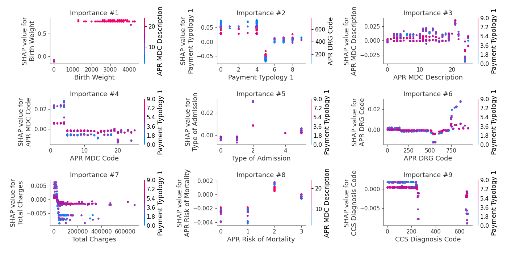
### Dependence 18 to 29 (Fold 1)
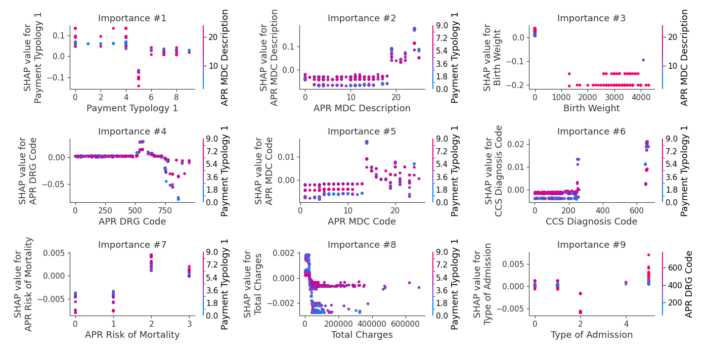
### Dependence 30 to 49 (Fold 1)
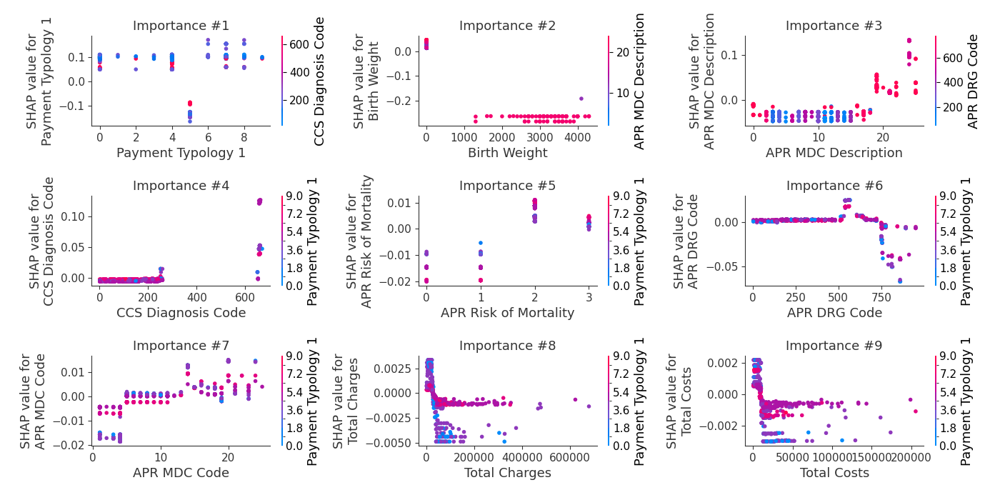
### Dependence 50 to 69 (Fold 1)
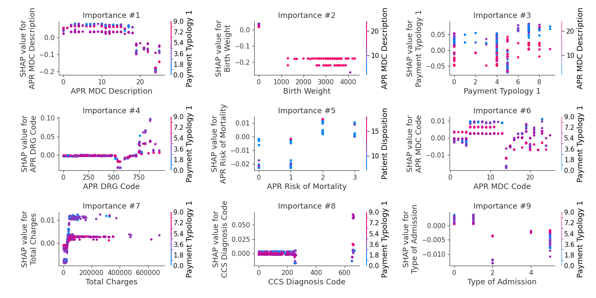
### Dependence 70 or Older (Fold 1)

## SHAP Decision plots

### Worst decisions for selected sample 1 (Fold 1)
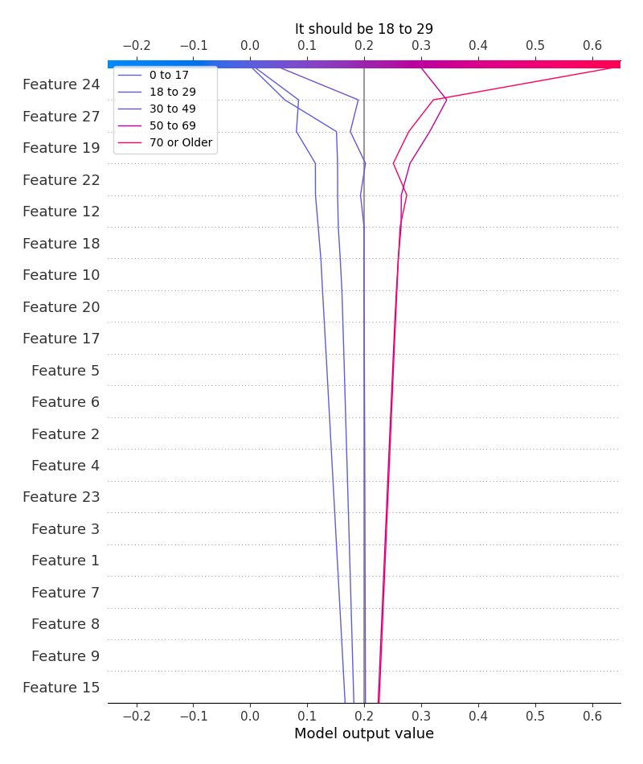
### Worst decisions for selected sample 2 (Fold 1)
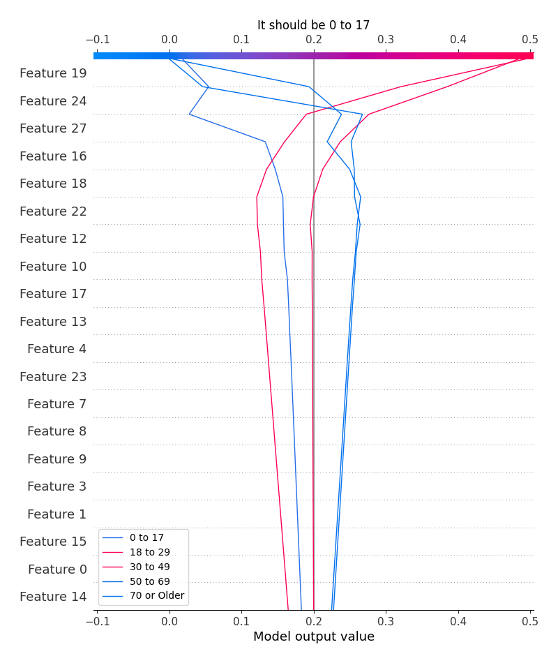
### Worst decisions for selected sample 3 (Fold 1)
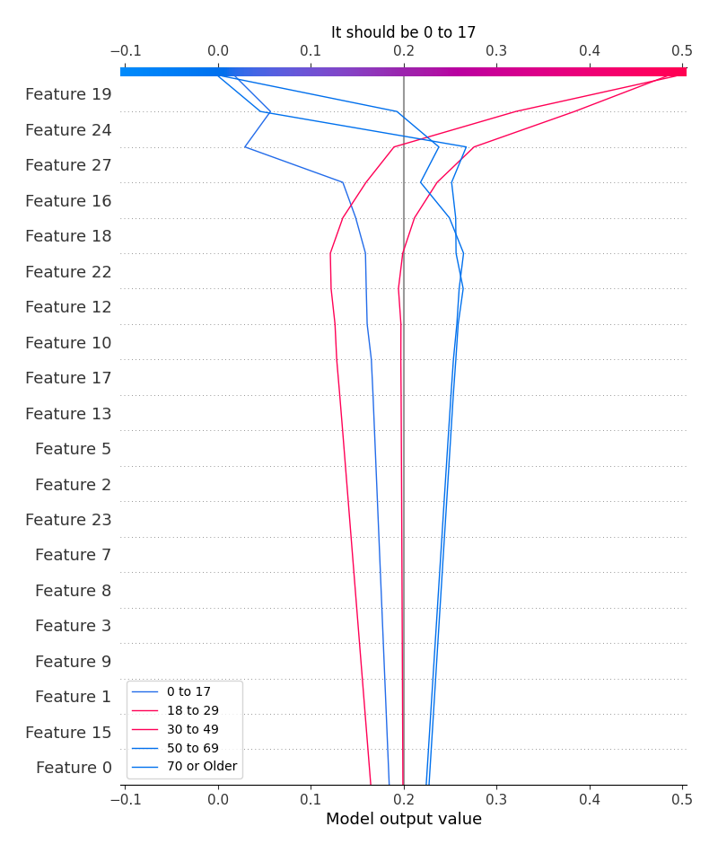
### Worst decisions for selected sample 4 (Fold 1)
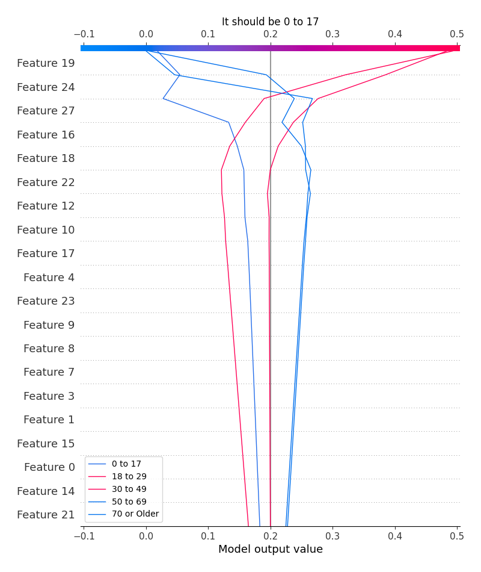
### Best decisions for selected sample 1 (Fold 1)

### Best decisions for selected sample 2 (Fold 1)

### Best decisions for selected sample 3 (Fold 1)

### Best decisions for selected sample 4 (Fold 1)
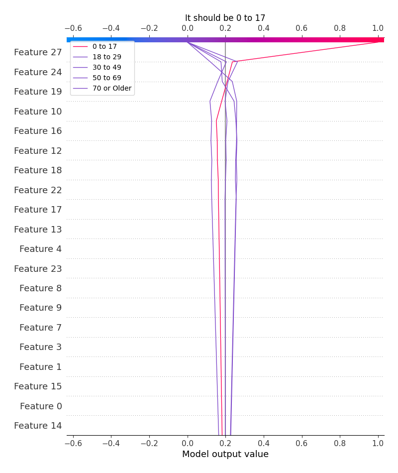

[<< Go back](../README.md)
