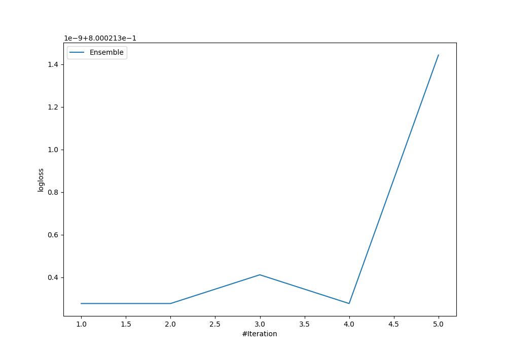
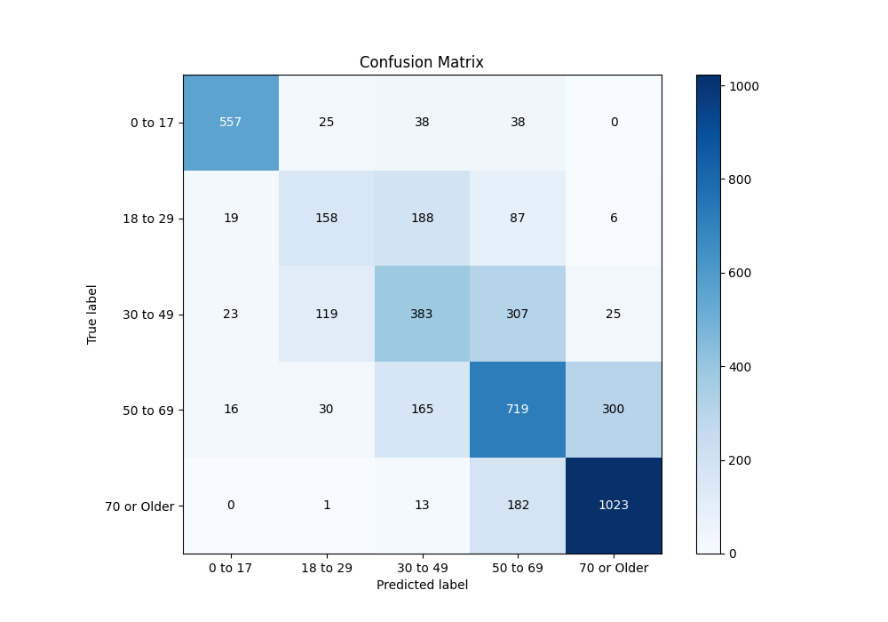
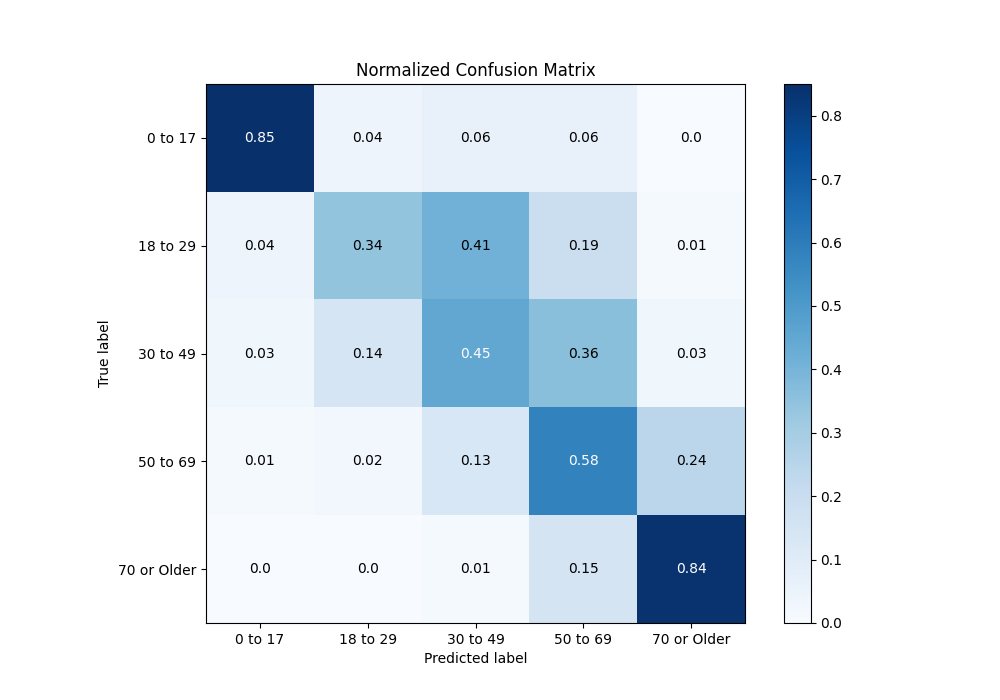
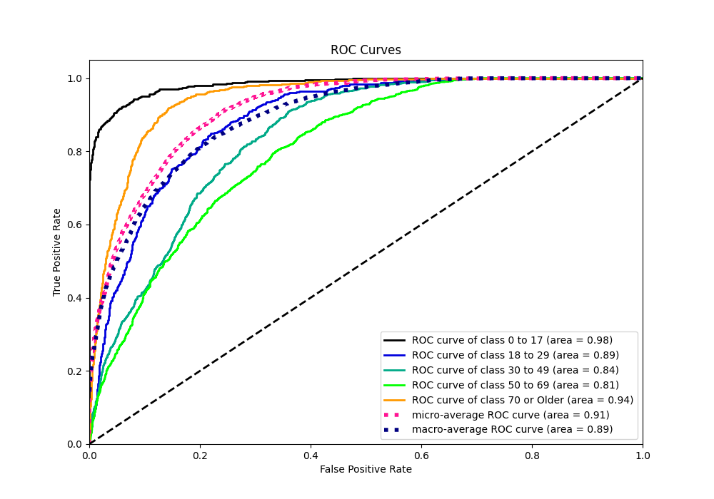
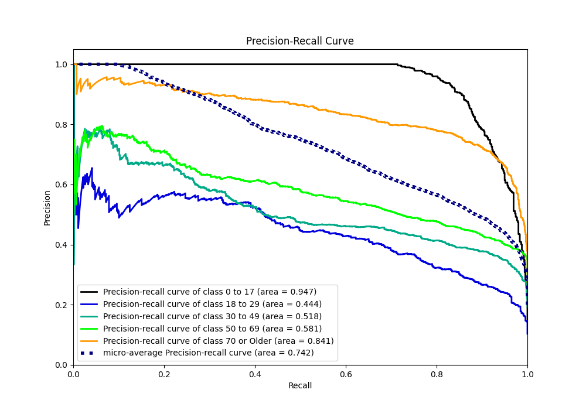

# Summary of Ensemble

[<< Go back](../README.md)

## Ensemble structure
| Model             |   Weight |
|:------------------|---------:|
| 3_Default_Xgboost |        1 |

### Metric details
|           |    0 to 17 |   18 to 29 |   30 to 49 |    50 to 69 |   70 or Older |   accuracy |   macro avg |   weighted avg |   logloss |
|:----------|-----------:|-----------:|-----------:|------------:|--------------:|-----------:|------------:|---------------:|----------:|
| precision |   0.905691 |   0.474474 |   0.486658 |    0.539385 |      0.755539 |   0.642243 |    0.63235  |       0.636537 |  0.800021 |
| recall    |   0.846505 |   0.344978 |   0.446908 |    0.584553 |      0.839212 |   0.642243 |    0.612431 |       0.642243 |  0.800021 |
| f1-score  |   0.875098 |   0.399494 |   0.465937 |    0.561061 |      0.795181 |   0.642243 |    0.619354 |       0.63716  |  0.800021 |
| support   | 658        | 458        | 857        | 1230        |   1219        |   0.642243 | 4422        |    4422        |  0.800021 |

## Confusion matrix
|                        |   Predicted as 0 to 17 |   Predicted as 18 to 29 |   Predicted as 30 to 49 |   Predicted as 50 to 69 |   Predicted as 70 or Older |
|:-----------------------|-----------------------:|------------------------:|------------------------:|------------------------:|---------------------------:|
| Labeled as 0 to 17     |                    557 |                      25 |                      38 |                      38 |                          0 |
| Labeled as 18 to 29    |                     19 |                     158 |                     188 |                      87 |                          6 |
| Labeled as 30 to 49    |                     23 |                     119 |                     383 |                     307 |                         25 |
| Labeled as 50 to 69    |                     16 |                      30 |                     165 |                     719 |                        300 |
| Labeled as 70 or Older |                      0 |                       1 |                      13 |                     182 |                       1023 |

## Learning curves

## Confusion Matrix

## Normalized Confusion Matrix

## ROC Curve

## Precision Recall Curve

[<< Go back](../README.md)
