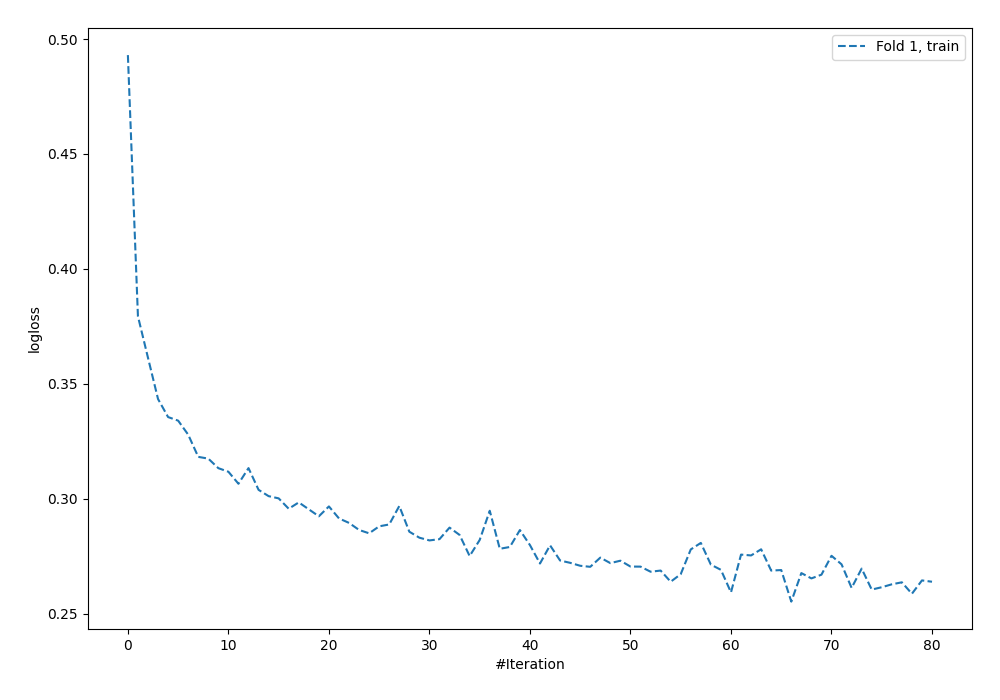
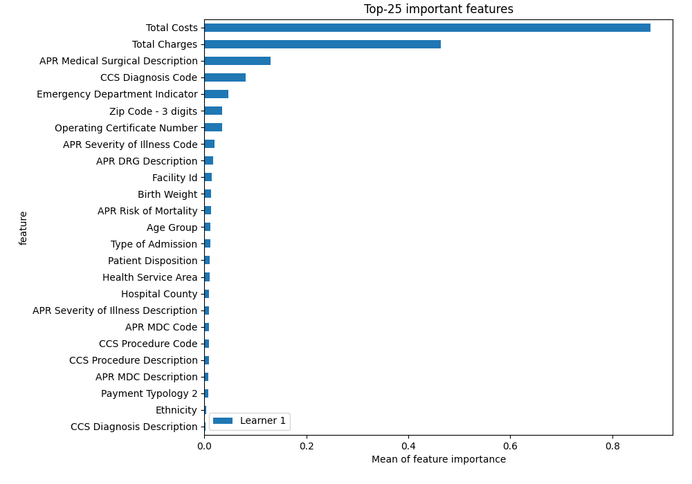
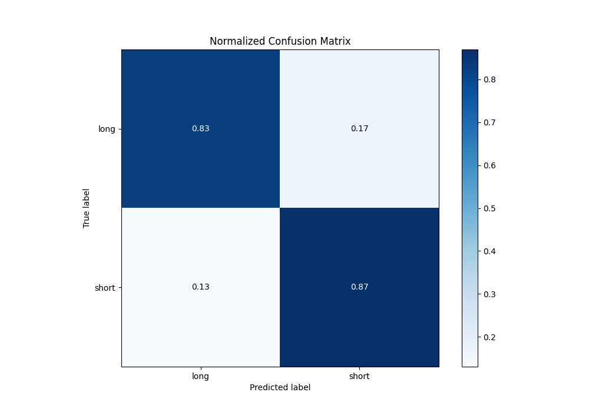
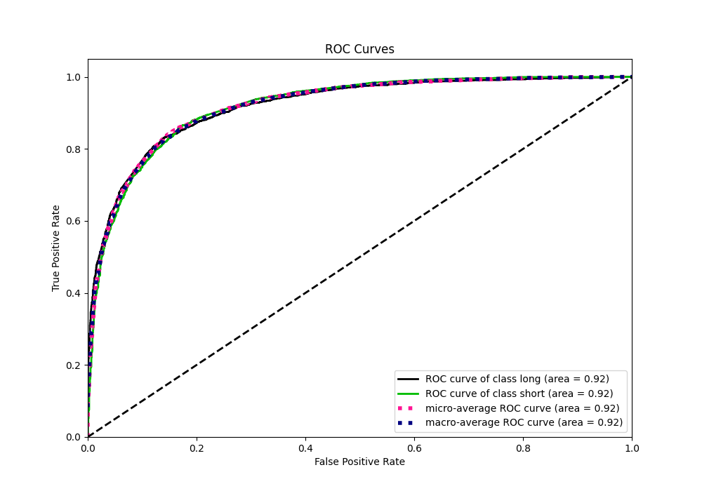
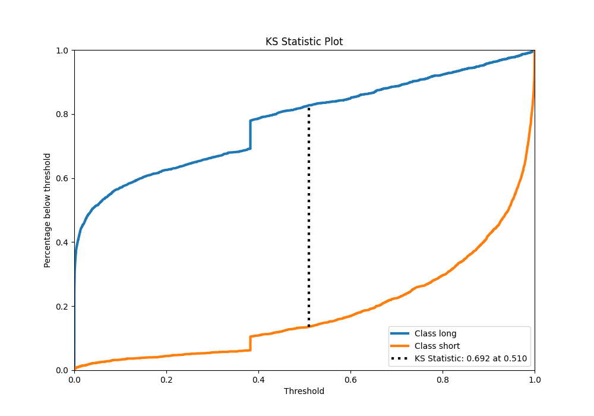
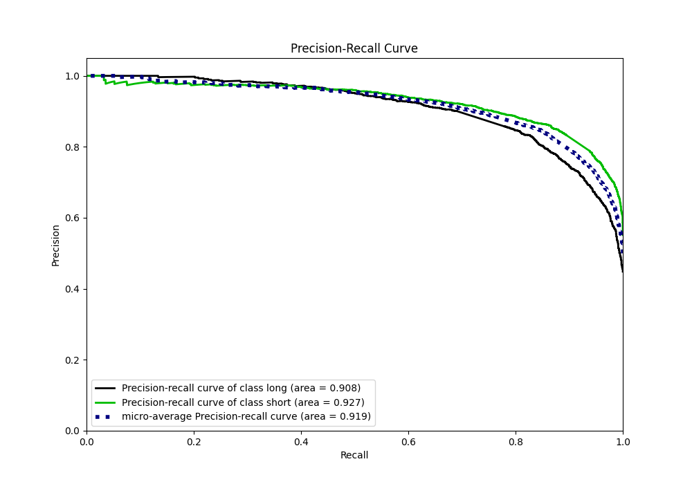

# Summary of 4_Default_NeuralNetwork

[<< Go back](../README.md)

## Neural Network
- **n_jobs**: -1
- **dense_1_size**: 32
- **dense_2_size**: 16
- **learning_rate**: 0.05
- **explain_level**: 2

## Validation
 - **validation_type**: split
 - **train_ratio**: 0.75
 - **shuffle**: True
 - **stratify**: True

## Optimized metric
logloss

## Training time

3.6 seconds

## Metric details
|           |    score |     threshold |
|:----------|---------:|--------------:|
| logloss   | 0.394009 | nan           |
| auc       | 0.919522 | nan           |
| f1        | 0.863528 |   0.421173    |
| accuracy  | 0.84758  |   0.505653    |
| precision | 0.978632 |   0.994661    |
| recall    | 1        |   2.31356e-19 |
| mcc       | 0.691622 |   0.505653    |

## Metric details with threshold from accuracy metric
|           |    score |   threshold |
|:----------|---------:|------------:|
| logloss   | 0.394009 |  nan        |
| auc       | 0.919522 |  nan        |
| f1        | 0.862393 |    0.505653 |
| accuracy  | 0.84758  |    0.505653 |
| precision | 0.858886 |    0.505653 |
| recall    | 0.865929 |    0.505653 |
| mcc       | 0.691622 |    0.505653 |

## Confusion matrix (at threshold=0.505653)
|                  |   Predicted as long |   Predicted as short |
|:-----------------|--------------------:|---------------------:|
| Labeled as long  |                1636 |                  347 |
| Labeled as short |                 327 |                 2112 |

## Learning curves

## Permutation-based Importance

## Confusion Matrix

## Normalized Confusion Matrix

## ROC Curve

## Kolmogorov-Smirnov Statistic

## Precision-Recall Curve

[<< Go back](../README.md)
