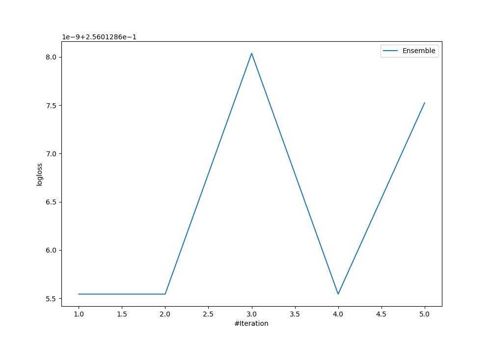
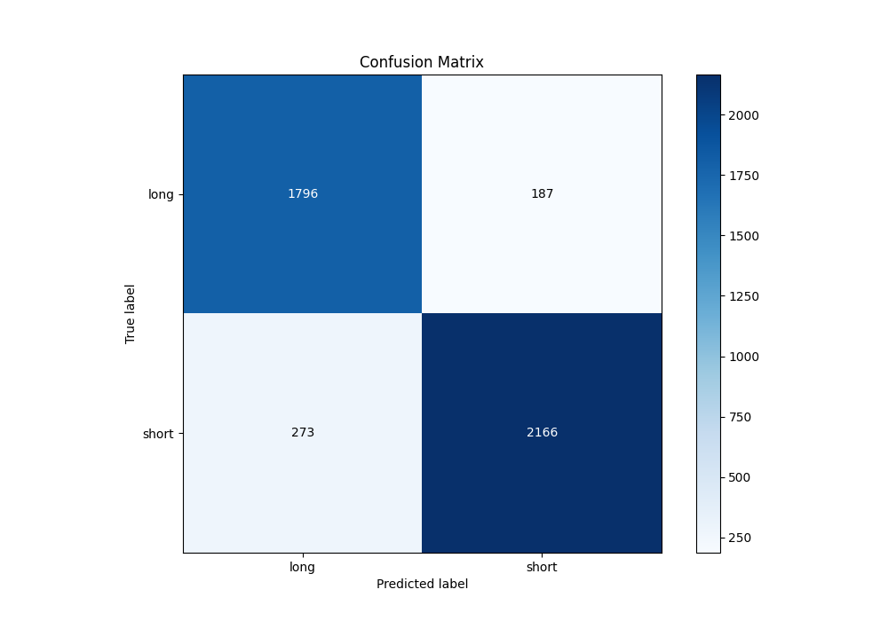
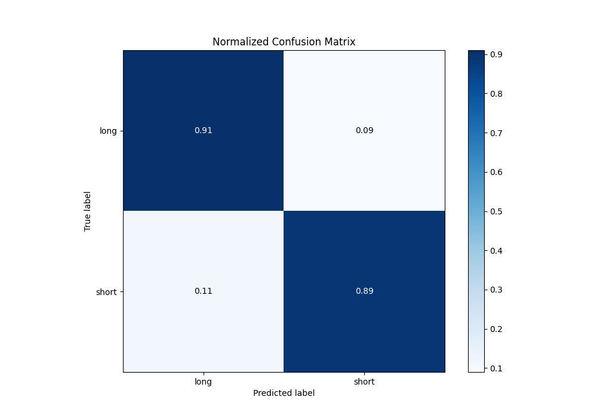
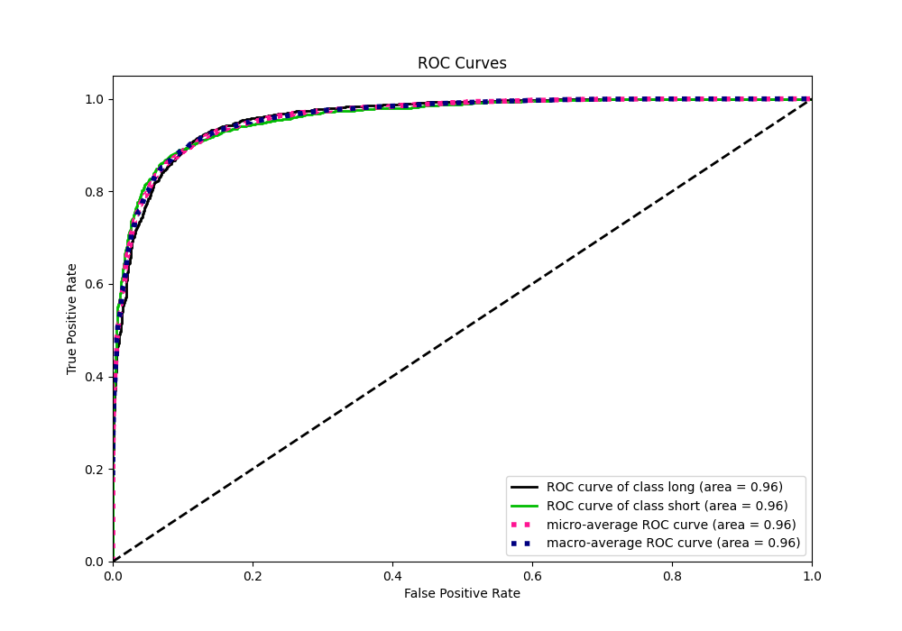
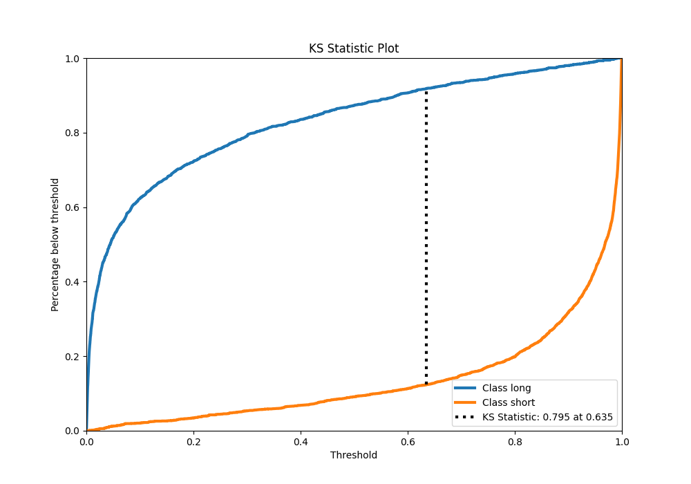
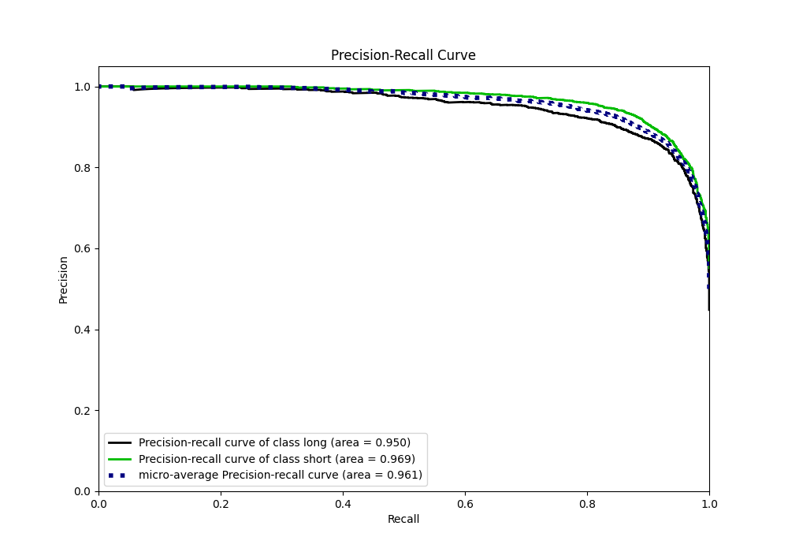

# Summary of Ensemble

[<< Go back](../README.md)

## Ensemble structure
| Model             |   Weight |
|:------------------|---------:|
| 3_Default_Xgboost |        1 |

## Metric details
|           |    score |    threshold |
|:----------|---------:|-------------:|
| logloss   | 0.256013 | nan          |
| auc       | 0.96002  | nan          |
| f1        | 0.904007 |   0.595792   |
| accuracy  | 0.895975 |   0.595792   |
| precision | 1        |   0.99232    |
| recall    | 1        |   9.7422e-05 |
| mcc       | 0.791169 |   0.595792   |

## Metric details with threshold from accuracy metric
|           |    score |   threshold |
|:----------|---------:|------------:|
| logloss   | 0.256013 |  nan        |
| auc       | 0.96002  |  nan        |
| f1        | 0.904007 |    0.595792 |
| accuracy  | 0.895975 |    0.595792 |
| precision | 0.920527 |    0.595792 |
| recall    | 0.888069 |    0.595792 |
| mcc       | 0.791169 |    0.595792 |

## Confusion matrix (at threshold=0.595792)
|                  |   Predicted as long |   Predicted as short |
|:-----------------|--------------------:|---------------------:|
| Labeled as long  |                1796 |                  187 |
| Labeled as short |                 273 |                 2166 |

## Learning curves

## Confusion Matrix

## Normalized Confusion Matrix

## ROC Curve

## Kolmogorov-Smirnov Statistic

## Precision-Recall Curve

[<< Go back](../README.md)
